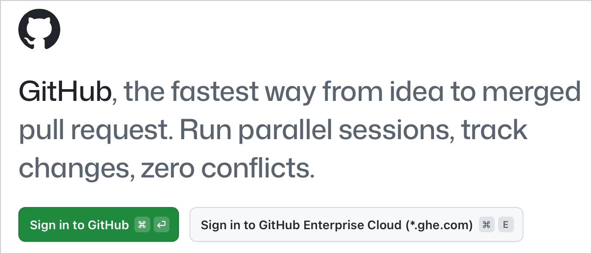
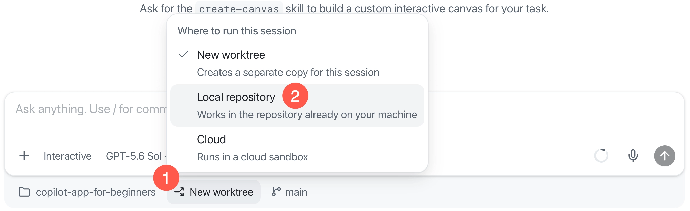

## Learning Objectives

By the end of this chapter, you'll be able to:

- Install and set up the GitHub Copilot app
- Connect the repository to an agent session

Once the app can see the repository, Chapter 01 explains why you'd use the app and starts the real hands-on path.

> ⏱️ **Estimated Time**: ~20 minutes

## Prerequisites

- A [GitHub account](https://github.com/signup). 
- A [Copilot plan](https://github.com/features/copilot/plans), or you can opt to continue with your own model provider during sign-in
    - For Copilot Business or Enterprise, the **GitHub Copilot app** policy must be enabled.
- [Git](https://git-scm.com/install) installed on your machine
- [Node.js LTS](https://nodejs.org) to run `samples/book-app-web` for the hands-on exercises
- [GitHub CLI (`gh`)](https://cli.github.com) for the initial one-time setup script used in the course

You will check the tool versions in the Copilot app's **Terminal** tab after connecting your repository.

## Installation

1. [Download and install the GitHub Copilot app][app-install] for your operating system.
2. Open the app and select *Sign in to GitHub*.
3. Sign in with your GitHub account, or enter your GitHub Enterprise Server URL if your organization uses one.


4. Connect your repositories: Select **Continue**
5. Pick a theme, and select **Finish**


Once signed in, you'll land on an empty home page. The app uses your GitHub identity and repository permissions to surface the work you can access, so your projects and tasks appear here as you continue with setup.

> [!TIP]
> If a repository or issue is missing on the app, the first thing to check is account access and organization policy.


## Connect to your repository

> [!NOTE]
> If the Copilot app reports that Git is missing when you connect your repository, [install Git](https://git-scm.com/install), then retry the connection.

1. Fork this [course's repository on GitHub][fork-repo-link]

2. On the Copilot app, select the **+** button next to **Sessions** to open the **Add project from** dialog. It offers several options for connecting a project.

    

    | If you've got... | Use this app option |
    |---|---|
    | A cloned copy on your machine | **Local folder or repository**, then select your local folder |
    | A repository on GitHub | **GitHub repository**, then search for your fork `copilot-app-for-beginners`|
    | A repository URL | **Repository URL**, then paste the fork URL |

3. Select **GitHub repository** and type `copilot-app-for-beginners` to select the fork you just created from the list. The app will clone the repo and it'll show up in the sidebar

## Check your tools in Terminal

> [!NOTE]
> Use the GitHub Copilot app's **Terminal** tab to run commands. Use the prompt box to send requests to the agent. In [Chapter 03](../03-development-workflows/README.md#confirm-the-sample-app-is-ready), you will use Terminal again to run tests, build the sample app, and start its development server.

1. The Copilot app sidebar should display the `copilot-app-for-beginners` project and a new session for it. 

1. Locate the workspace selector below the prompt box and choose **Local repository** instead of **New worktree**.

    This uses your existing local clone for setup. You will learn about worktrees in Chapter 02.



1. Select **View** > **Toggle Review Panel** to open the side panel if it is not already visible.

1. Select the **Terminal** tab. If it is not visible, select **+**, then **Terminal**.

1. In **Terminal**, run these version checks to ensure that the prerequisites are installed correctly.

    ```bash
    git --version
    node -v
    npm -v
    gh --version
    ```

    Each command should display a version number.

    Install only the tools that are missing, using the links in [Prerequisites](#prerequisites), then run the checks again.

1. The setup script uses GitHub CLI to create the training items on GitHub. Check its sign-in separately from the Copilot app sign-in. In the same **Terminal** tab, run:

    ```bash
    gh auth status
    ```

    Confirm that the active account is the one you used to fork the course repository. If you are not signed in, run:

    ```bash
    gh auth login
    ```

    Select **GitHub.com**, then **Login with a web browser** when asked how to sign in. Use the same account you used to create the fork. After sign-in, run `gh auth status` again and confirm that this account is active before you continue.

## Seed the repository

Later chapters in this course rely on practice branches, issues, pull requests, a conversation comment, and a failing-check scenario created by the script. Skip this step only if you plan to add those items manually using the [Training GitHub Scenarios appendix](../appendices/training-github-scenarios.md#manual-fallback-create-the-labels).

1. Open the **Actions** tab in your fork on GitHub.com. New forks disable workflows by default. If you see **Workflows aren't being run on this forked repository**, select **I understand my workflows, go ahead and enable them**.

    Enable workflows before running the setup script so the seeded failing-check pull request starts its GitHub Actions check.

1. Return to the same **Terminal** tab in the Copilot app. From the root folder of your cloned fork, run the following command to preview the setup without creating training items:

    ```bash
    node .github/scripts/setup-training-scenarios.js --dry-run
    ```

    Wait for the preview to finish. Confirm that the `Repository:` line in the output shows your fork before you continue.

1. In the same **Terminal** tab, run the setup script:

    ```bash
    node .github/scripts/setup-training-scenarios.js --yes
    ```

    The script creates the GitHub issues, branches, pull requests, comments, and failing-check scenarios used in later chapters. It is safe to rerun because it reuses items that already exist.

    > [!NOTE]
    > If your fork belongs to an organization instead of your personal account, the script treats it as a shared repository and stops before making changes. If you're authorized to seed that organization repository, add the explicit safeguard:
    >
    > ```bash
    > node .github/scripts/setup-training-scenarios.js --yes --allow-shared-repository
    > ```

### Checklist

After setup, you should have:

- [ ] A fork connected to the Copilot app
- [ ] [Course labels](../appendices/training-github-scenarios.md#manual-fallback-create-the-labels)
- [ ] [Training issues](../appendices/training-github-scenarios.md#manual-fallback-create-the-seeded-issues)
- [ ] [Practice branches](../appendices/training-github-scenarios.md#manual-fallback-create-practice-branches)
- [ ] [Training pull requests](../appendices/training-github-scenarios.md#manual-fallback-create-pull-request-scenarios)

> [!NOTE]
> If the issues are not created after running the script, navigate to your repository on GitHub.com, **Settings** and **enable issues** under **Features**. Then rerun the script.
> 
> If you were unable to run the script, you can complete the manual steps in [appendices/training-github-scenarios.md](../appendices/training-github-scenarios.md) before Chapters 02 and 03.

### Your first prompt

Wait for the setup script to finish, then return to the prompt box in the project session. Submit the following request to the Copilot app, not to Terminal:

```text
Give me an overview of the copilot-app-for-beginners course repository. Focus on the learning path and the samples/book-app-web folder.
```

**Expected Output:** The Copilot app should summarize the course structure and identify `samples/book-app-web` as the web sample used for later exercises.

---

## Troubleshooting


<details>
<summary>Setup and access problems</summary>

### I Cannot Sign In

Check:

- You're using the expected GitHub account
- You have a Copilot plan, or you continued with your own model provider
- Your organization left the **GitHub Copilot app** policy enabled (separate from the Copilot CLI policy)
- You entered the correct GitHub Enterprise Server URL if required

### I Cannot See the Repository

Check:

- You've got access to the repository on GitHub
- You selected the correct account or organization
- You tried the local folder option if the repository is already cloned

### A Chat Cannot Explain the Repository

Check:

- The correct repository is connected
- The prompt mentions `copilot-app-for-beginners`
- The app has permission to read the project folder

</details>

---

## Key Takeaways

1. The GitHub Copilot app is a desktop control center for agent-driven coding work
2. This course uses `samples/book-app-web` as the main sample app path
3. Run the setup script so later chapters have practice branches, issues, and pull request scenarios ready

## What's Next

### The Course Theme: Working in a Recording Studio

Throughout this course, we'll use a recording studio as a recurring analogy for working with the GitHub Copilot app. Each chapter will connect a part of agent-driven development to the familiar process of preparing, recording, reviewing and refining a track.

Before you record anything, you get the studio ready. You sign in for access, plug in your gear, load the song you'll work on and run a quick soundcheck before you commit a single take.


The setup you just completed is the software equivalent of preparing that studio.

In the next chapter, you'll answer a practical question first: why use the GitHub Copilot app if you already use GitHub Copilot in an editor or terminal? Then you'll tour the interface and learn about the different session types and modes.

**[← Back to course README](../README.md)** | **[Continue to Chapter 01 →](../01-tour-the-app/README.md)**

[fork-repo-link]: https://github.com/DanWahlin/copilot-app-for-beginners/fork
[app-install]: https://github.com/features/ai/github-app
