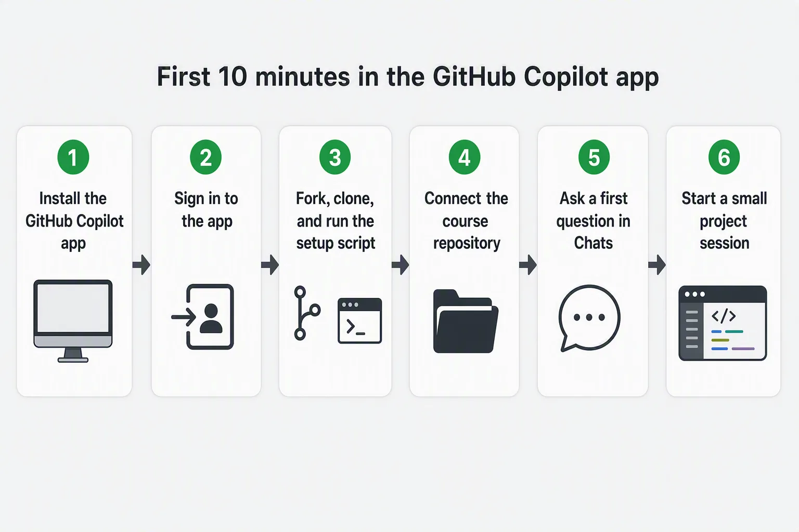
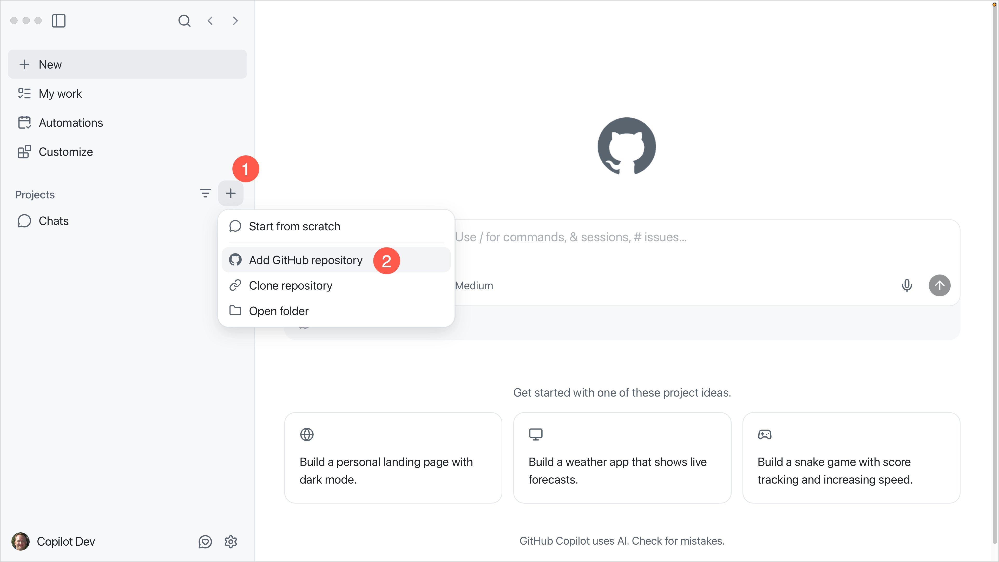

> **What if your first setup pass ended with a prepared training repo, a read-only chat overview, and a first session you can inspect?**

Welcome! This chapter gets the basics out of the way:

- Install the GitHub Copilot app and sign in
- Fork and clone the course repository
- Run the training setup script so later chapters have issues, pull requests (PRs), and practice branches ready
- Connect the repository in the app
- Verify that a chat can explain the project without changing files

Once the app can see the repository, Chapter 01 explains why you'd use the app and starts the real hands-on path.

## 🎯 Learning Objectives

By the end of this chapter, you'll be able to:

- Confirm the required account, Git, operating system, and Copilot access prerequisites
- Install, open, and sign in to the GitHub Copilot app
- Fork, clone, and prepare the course repository for later GitHub workflow chapters
- Connect the repository to the app
- Use Chats for a read-only repository overview
- Create a first project session in Interactive mode

> ⏱️ **Estimated Time**: ~35 minutes (20 min setup + 15 min hands-on)

---

## ✅ Prerequisites

- A [GitHub account](https://github.com/signup). A [Copilot plan](https://github.com/features/copilot/plans) is the usual path; you can also continue with your own model provider during sign-in
- [Git](https://git-scm.com/install) installed
- A fork of the [course repository][course-repository]. Many chapters in the course use the issues, branches, and pull requests seeded into your fork, so treat the fork as required unless you only plan to read along
- [Node.js LTS and npm](https://nodejs.org) for the setup script and for later chapters that use `samples/book-app-web`
- [GitHub CLI (`gh`)](https://cli.github.com) for the setup script used in the course
- Permission to use the app if your account belongs to a GitHub Copilot Business or Enterprise organization

> Note: The GitHub Copilot app is available with a Copilot plan, or you can continue with your own model provider (bring your own key) during sign-in. For Copilot Business or Enterprise, an administrator must leave the **GitHub Copilot app** policy enabled. That policy is on by default and is separate from the Copilot CLI policy.

Quick checks before you continue (run these in a terminal):

```bash
git --version
node -v
npm -v
gh --version
```

You should see a version number for each command. Install anything that is missing before the setup script step. The sample app needs a current Node.js LTS release. If `npm install` later fails with an engines error, update Node from [nodejs.org](https://nodejs.org).

---

## 🧩 Real-World Analogy: Setting Up the Recording Studio

Before you record anything, you get the recording studio ready. You sign in for access, plug in your gear, load the song you'll work on, and run a quick soundcheck to make sure everything sounds right before you commit a single take.


The GitHub Copilot app setup is the same idea. The graphic matches the six steps below.

1. Install the GitHub Copilot app
2. Sign in to the app
3. Fork, clone, and run the setup script
4. Connect the course repository
5. Ask a first question in Chats
6. Start a small project session



## Core Concepts

| Concept | Description |
|---|---|
| GitHub Copilot app | A desktop app for supervising agent-driven development work |
| Chat | A conversation for exploration that does not create a branch or worktree |
| Project | A connected repository or folder the app can work with |
| Session | A focused agent workspace for a task |
| Interactive mode | A session mode where you steer the agent step by step |

---

## Hands-On Exercises

In these exercises, you'll:

- Install the GitHub Copilot app and sign in
- Fork, clone, and prepare the course repository with the setup script
- Connect the repository to the app
- Ask a read-only question in Chats, then create your first project session

### 1. Install and Sign In

1. [Download and install the GitHub Copilot app][getting-started] for your operating system.
2. Open the app.
3. Select *Sign in to GitHub*.
4. Sign in with your [GitHub account][github-signup], or enter your GitHub Enterprise Server URL if your organization uses one.
5. Complete any first-run choices such as theme or repository access.

#### Expected Output

You'll see the main app window with navigation areas such as Home, My work, Automations, Search, Sessions, and Chats.


#### How It Works

The app uses your GitHub identity and repository permissions to show work you can access. If a repository or issue is missing, the first thing to check is account access and organization policy.

---

### 2. Fork, Clone, and Prepare the Course Repository

Forking gives you your own copy of the course repository so the setup script can add the issues, branches, and pull requests used in later chapters.

1. Fork this [course's repository on GitHub][course-repository] by selecting the `Fork` button on the repository page. 

2. Clone the forked repository (make sure you have [Git installed][git-install]):

    ```bash
    git clone https://github.com/YOUR-USER/copilot-app-for-beginners.git
    cd copilot-app-for-beginners
    ```

3. Install the [GitHub CLI (`gh`)][github-cli] if needed, then sign in:

    ```bash
    gh auth login
    ```

4. Run the setup script.

    > Note: Before running the setup script, review [appendices/training-github-scenarios.md](../appendices/training-github-scenarios.md) to see the issues, branches, pull requests, comments, and failing-check scenario it creates.
    >
    > **Run this script.** Later chapters use the practice branches, issues, pull requests, review comments, and failing-check scenarios it creates. Skip it only if you will add those items yourself with the manual steps in the appendix.

    **Do a dry run of the setup script**

    ```bash
    node .github/scripts/setup-training-scenarios.js --dry-run
    ```

    Confirm that the `Repository:` line shows your fork.

    **Run the script**

    ```bash
    node .github/scripts/setup-training-scenarios.js --yes
    ```

    The same Node.js command works on Windows, macOS, and Linux. The `--yes` option confirms that you reviewed the repository shown by the dry run. The script creates the GitHub issues, branches, pull requests, comments, and failing-check scenario used in later chapters. It is safe to rerun if needed because it reuses items that already exist.

#### Success Check

You've got a local clone of your fork, and the setup script finished successfully. If you could not run the script, complete the manual steps in [appendices/training-github-scenarios.md](../appendices/training-github-scenarios.md) before Chapters 02 and 03.

---

### 3. Connect the Course Repository

In the app sidebar, select the **+** button next to **Sessions** to open the **Add project from** dialog. It offers several options for connecting a project.

| If you've got... | Use this app option |
|---|---|
| A cloned copy on your machine | **Local folder or repository**, then select your local `copilot-app-for-beginners` folder |
| A repository on GitHub | **GitHub repository**, then search for your fork |
| A repository URL | **Repository URL**, then paste the fork URL |



Select **Local folder or repository** and navigate to your clone of the course repository.

```text
copilot-app-for-beginners
```

#### Success Check

You'll see the course repository in the app, and the app sidebar will show the project as available.

---

### 4. Ask Your First Chat

Select the **+** next to `Chats` in the sidebar and submit the following prompt:

```text
Give me an overview of the copilot-app-for-beginners course repository. Focus on the learning path and the samples/book-app-web folder.
```

#### Expected Output

Copilot should summarize the course structure and identify `samples/book-app-web` as the web sample used for later exercises.

#### How It Works

A chat is useful for exploration because it does not create a session branch or worktree. Use a chat when you're asking questions before changing code.

---

### 5. Create Your First Project Session

This is a quick smoke test so you can see where project sessions live. Chapter 01 covers session modes in more depth.

Create a new project session in Interactive mode by selecting the **+** next to `copilot-app-for-beginners` in the sidebar. In the session composer, choose **Interactive** from the mode selector and submit the following prompt.

```text
Explain the app structure and suggest one beginner-friendly improvement. Do not edit files yet.
```

#### Expected Output

Copilot should explain the repository at a high level and suggest a small possible improvement without making changes.

#### Success Check

You're able to answer these questions:

- Where do chats appear?
- Where do project sessions appear?
- Which sample app path will this course use?
- Did Copilot avoid editing files when asked?

---

## Troubleshooting

If you are still stuck after this list, see the [Troubleshooting Reference](../appendices/troubleshooting-reference.md).

<details>
<summary>Setup and access problems</summary>

### I Cannot Sign In

Check:

- You're using the expected GitHub account
- You have a Copilot plan, or you continued with your own model provider
- Your organization left the **GitHub Copilot app** policy enabled (separate from the Copilot CLI policy)
- You entered the correct GitHub Enterprise Server URL if required

### I Cannot See the Repository

Check:

- You've got access to the repository on GitHub
- You selected the correct account or organization
- You tried the local folder option if the repository is already cloned

### A Chat Cannot Explain the Repository

Check:

- The correct repository is connected
- The prompt mentions `copilot-app-for-beginners`
- The app has permission to read the project folder

</details>

---

## 🔑 Key Takeaways

1. The GitHub Copilot app is a desktop control center for agent-driven coding work
2. Chats are safe for exploration because they don't create a branch or worktree
3. Project sessions are where focused repository work begins
4. This course uses `samples/book-app-web` as the main sample app path
5. [Run the setup script](#2-fork-clone-and-prepare-the-course-repository) so later chapters have practice branches, issues, and pull request scenarios ready

---

## 📝 Assignment


Confirm your setup is ready for the rest of the course:

1. In your fork on GitHub, open the **Issues** tab and confirm the setup script created the five course issues. Then open the branch list and look for the `practice-*` branches.
2. In the app, open a new chat by selecting the `+` icon next to `Chats` in the sidebar and submit the following prompt:

   ```text
   List the top-level folders in the copilot-app-for-beginners repository and tell me which one contains the sample web app.
   ```

Success criteria: Your fork shows the seeded issues and branches, and the chat correctly identifies `samples`.

---

## ➡️ What's Next

In the next chapter, you'll answer a practical question first: why use the GitHub Copilot app if you already use GitHub Copilot in an editor or terminal? Then you'll tour the interface, compare chats with sessions, and learn when to use Interactive, Plan, and Autopilot modes.

**[← Back to course README](../README.md)** | **[Continue to Chapter 01 →](../01-tour-the-app/README.md)**

---

## Source References

- [Getting started with the GitHub Copilot app][getting-started]
- [About the GitHub Copilot app][about-app]
- [Working with agent sessions][agent-sessions]

[course-repository]: https://github.com/DanWahlin/copilot-app-for-beginners
[getting-started]: https://docs.github.com/copilot/how-tos/github-copilot-app/getting-started
[about-app]: https://docs.github.com/copilot/concepts/agents/github-copilot-app
[agent-sessions]: https://docs.github.com/copilot/how-tos/github-copilot-app/agent-sessions
[github-signup]: https://github.com/signup
[git-install]: https://git-scm.com/install
[github-cli]: https://cli.github.com
