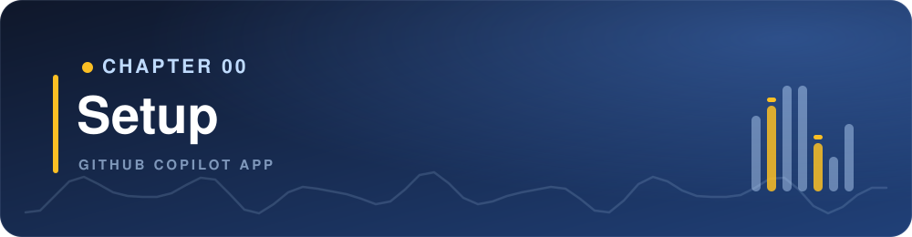
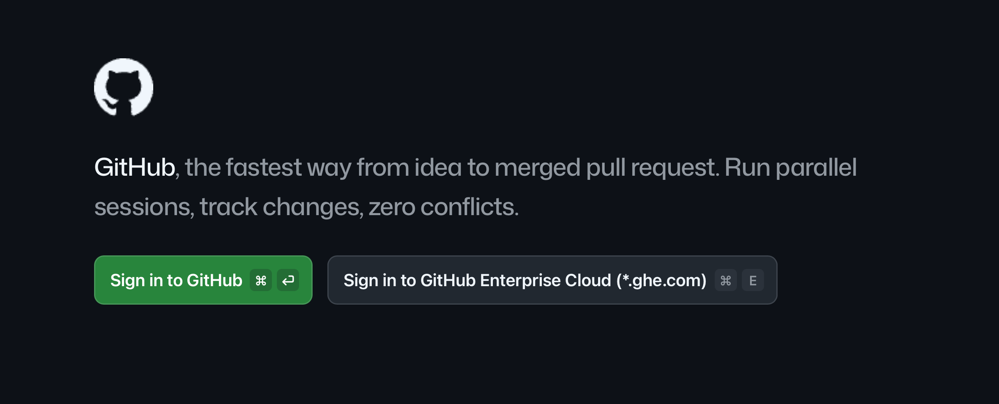
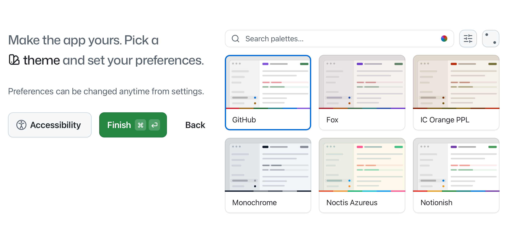
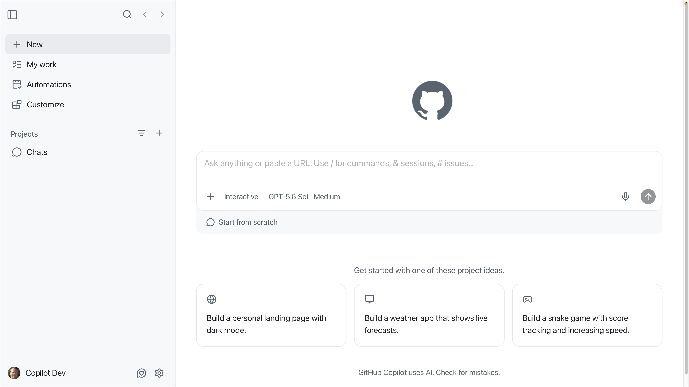
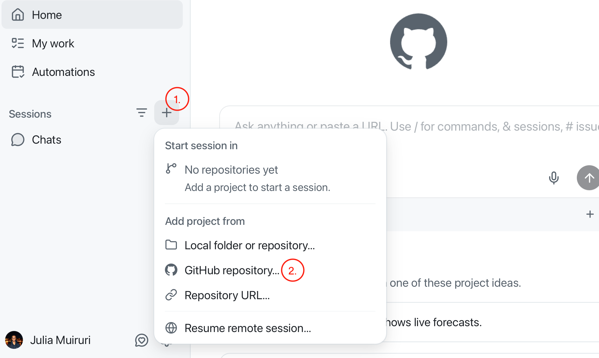
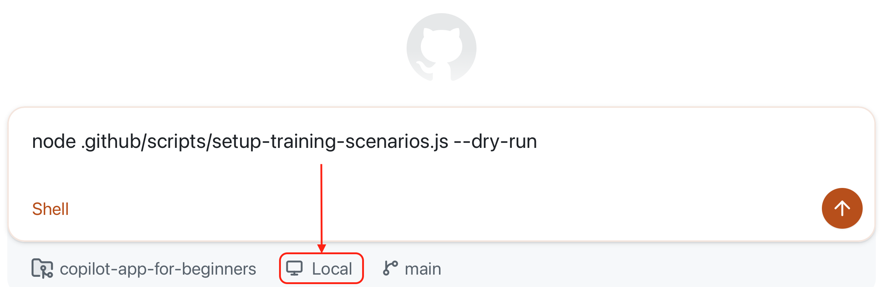

## Learning Objectives

By the end of this chapter, you'll be able to:

- Install and set up the GitHub Copilot app
- Connect the repository to an agent session

Once the app can see the repository, Chapter 01 explains why you'd use the app and starts the real hands-on path.

> ⏱️ **Estimated Time**: ~20 minutes

## Prerequisites

- A [GitHub account](https://github.com/signup). 
- A [Copilot plan](https://github.com/features/copilot/plans), or you can opt to continue with your own model provider during sign-in
    - For Copilot Business or Enterprise, the **GitHub Copilot app** policy must be enabled.
- [Git](https://git-scm.com/install) installed
- [Node.js LTS](https://nodejs.org) to run `samples/book-app-web` for the hands-on exercises
- [GitHub CLI (`gh`)](https://cli.github.com) for the initial on-time setup script used in the course

Quick checks before you continue (run these in a terminal). You should see a version number for each command:

```bash
git --version
node -v
npm -v
gh --version
```

Install anything that is missing before continuing to the setup script step.

## Installation

1. [Download and install the GitHub Copilot app][app-install] for your operating system.
2. Open the app and select *Sign in to GitHub*.
3. Sign in with your GitHub account, or enter your GitHub Enterprise Server URL if your organization uses one.

    

4. Connect your repositories: Select **Continue**
5. Pick a theme, and select **Finish**

    

Once signed in, you'll land on an empty home page. The app uses your GitHub identity and repository permissions to surface the work you can access, so your projects and tasks appear here as you continue with setup.

> [!TIP]
> If a repository or issue is missing on the app, the first thing to check is account access and organization policy.



## Connect to your repository

1. Fork this [course's repository on GitHub][fork-repo-link]

2. On the Copilot app, select the **+** button next to **Sessions** to open the **Add project from** dialog. It offers several options for connecting a project.

    

    | If you've got... | Use this app option |
    |---|---|
    | A cloned copy on your machine | **Local folder or repository**, then select your local folder |
    | A repository on GitHub | **GitHub repository**, then search for your fork `copilot-app-for-beginners`|
    | A repository URL | **Repository URL**, then paste the fork URL |

3. Select **GitHub repository** and type `copilot-app-for-beginners` to select the fork you just created from the list. The app will clone the repo and it'll show up in the sidebar

## Seed the repository

Later chapters in this course rely on practice branches, issues, pull requests, review comments, and failing-check scenarios created by the script. Skip this step only if you plan to add those items manually using the steps in the appendix.

1. Click on the chat window and press `Shift + 1` to switch to **Shell mode**. 
1. Agent sessions open in a **New worktree** by default, but for this lesson, click on **New worktree** and switch to **Local repository**. We'll cover more on worktrees in the next lesson.

    

1. Run the test script below.

    ```bash
    node .github/scripts/setup-training-scenarios.js --dry-run
    ```

    Your command will be executed through the terminal. Confirm that the `Repository:` line in the output shows your fork.

1. Run the setup script

    ```bash
    node .github/scripts/setup-training-scenarios.js --yes
    ```

    The script creates the GitHub issues, branches, pull requests, comments, and failing-check scenarios used in later chapters. It is safe to rerun because it reuses items that already exist.

### Checklist

- [ ] A fork of this course
- [ ] 5 open issues on the repository with applied labels
- [ ] 3 open pull requests

> [!NOTE]
> If the issues are not created after running the script, navigate to your repository on GitHub.com, **Settings** and **enable issues** under **Features**. Then rerun the script.
> 
> If you were unable to run the script, complete the manual steps in [appendices/training-github-scenarios.md](../appendices/training-github-scenarios.md) before Chapters 02 and 03.

### Your first prompt

On the chat window, submit the following prompt:

```text
Give me an overview of the copilot-app-for-beginners course repository. Focus on the learning path and the samples/book-app-web folder.
```

**Expected Output:** Copilot should summarize the course structure and identify `samples/book-app-web` as the web sample used for later exercises.

---

## Troubleshooting

If you are still stuck after this list, see the [Troubleshooting Reference](../appendices/troubleshooting-reference.md).

<details>
<summary>Setup and access problems</summary>

### I Cannot Sign In

Check:

- You're using the expected GitHub account
- You have a Copilot plan, or you continued with your own model provider
- Your organization left the **GitHub Copilot app** policy enabled (separate from the Copilot CLI policy)
- You entered the correct GitHub Enterprise Server URL if required

### I Cannot See the Repository

Check:

- You've got access to the repository on GitHub
- You selected the correct account or organization
- You tried the local folder option if the repository is already cloned

### A Chat Cannot Explain the Repository

Check:

- The correct repository is connected
- The prompt mentions `copilot-app-for-beginners`
- The app has permission to read the project folder

</details>

---

## Key Takeaways

1. The GitHub Copilot app is a desktop control center for agent-driven coding work
2. This course uses `samples/book-app-web` as the main sample app path
3. Run the setup script so later chapters have practice branches, issues, and pull request scenarios ready

## What's Next

### The Course Theme: Working in a Recording Studio

Throughout this course, we'll use a recording studio as a recurring analogy for working with the GitHub Copilot app. Each chapter will connect a part of agent-driven development to the familiar process of preparing, recording, reviewing and refining a track.

Before you record anything, you get the studio ready. You sign in for access, plug in your gear, load the song you'll work on and run a quick soundcheck before you commit a single take.


The setup you just completed is the software equivalent of preparing that studio.

In the next chapter, you'll answer a practical question first: why use the GitHub Copilot app if you already use GitHub Copilot in an editor or terminal? Then you'll tour the interface and learn about the different session types and modes.

**[← Back to course README](../README.md)** | **[Continue to Chapter 01 →](../01-tour-the-app/README.md)**

[fork-repo-link]: https://github.com/DanWahlin/copilot-app-for-beginners/fork
[app-install]: https://github.com/features/ai/github-app
