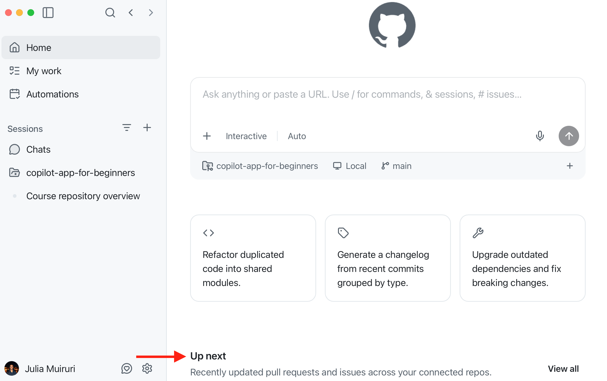
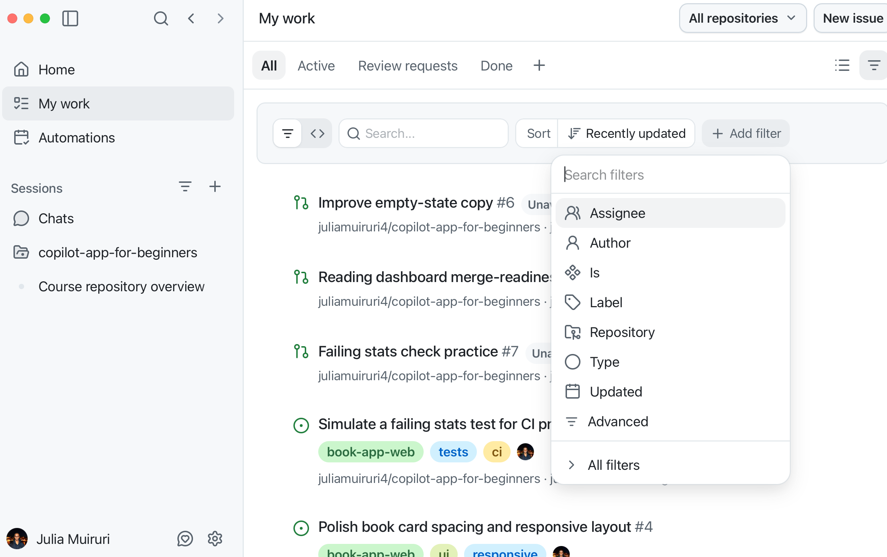
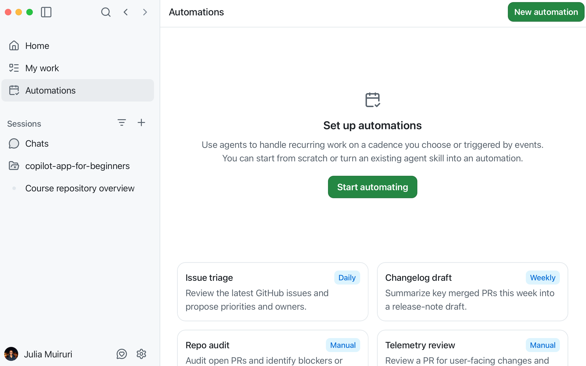
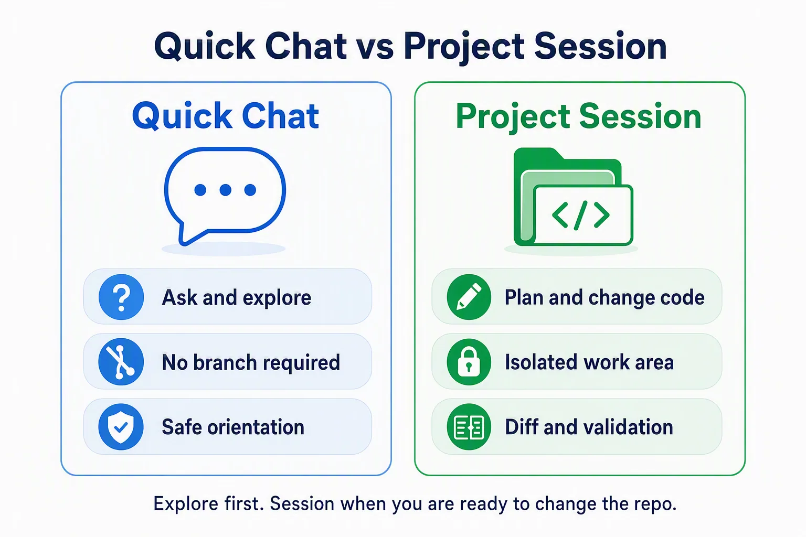
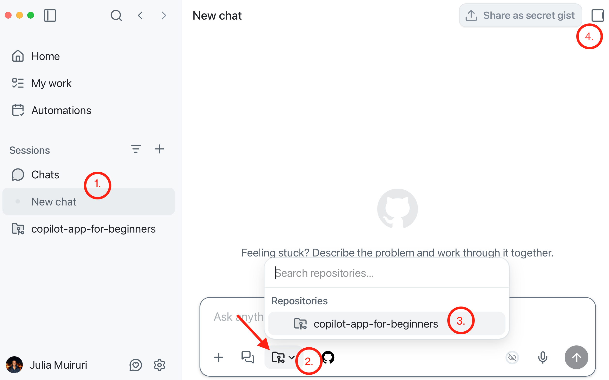
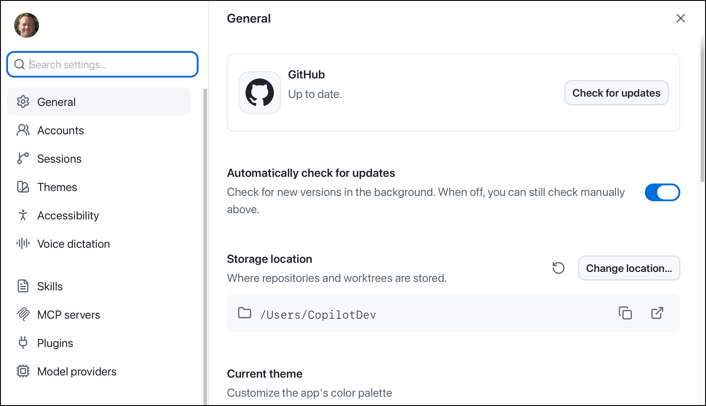

Now that the app is installed and connected to the course repository, this chapter answers why the desktop app helps if you already use GitHub Copilot in an editor or terminal. Then you'll tour the main navigation, compare chats with project sessions, and see how session modes change how much control you have.

## Learning Objectives

By the end of this chapter, you'll be able to:

- Explain why you should use the GitHub Copilot app compared to using Copilot in an editor or Copilot CLI in the terminal
- Understand key app features and settings
- Explain the session modes - Interactive, Plan and Autopilot
- Select models and assign reasoning efforts based on task complexity
- Optionally try voice dictation

> ⏱️ **Estimated Time**: ~40 minutes (20 min reading + 20 min hands-on)

## Prerequisites

If you jumped straight here, pause and complete [the set up step](../00-setup/README.md) to install the app and connect your repository.

## Why use the GitHub Copilot app?

If you already use GitHub Copilot in VS Code or use Copilot CLI in the terminal, why bother with a separate app?

### The challenge

GitHub Copilot in the editor or terminal is excellent next to the code you already have open. VS Code can also open multi-root workspaces when you need more than one folder. The harder part is supervising agent work end to end: planning, isolated edits, tests, previews, issues, and pull requests. You end up piecing the story together yourself and asking "where was I?"

| Challenge | What it feels like |
|---|---|
| Shared working copy | Two agent tasks touch the same folder and branch, and the changes blur together |
| Scattered evidence | Plan in chat, diff in the editor, tests in a terminal, PR in the browser |
| Explore versus change | A quick question and a real code change feel the same until files start changing |
| Repeat work | You retype the same prompt every week for PR summaries, checks or cleanup tasks |

### The solution

The GitHub Copilot app is designed to make that supervision loop easier. It is not a replacement for your editor, and it is not "multi-project support" by itself. Editors already handle multi-folder work. The app gives you a desktop place to run and review project sessions, keep task evidence together, and move work through GitHub without hunting across tools.

| Challenge | What the app adds |
|---|---|
| Shared working copy | Project sessions keep focused work separate (you'll learn about worktrees later) |
| Scattered evidence | Project sessions, diffs, terminal output, browser previews, and GitHub work in one desktop app |
| Explore versus change | Chats for safe questions; project sessions when you are ready to work in the repo |
| Repeat work | Automations save a prompt and run it on demand, on a schedule or from selected GitHub events |


You still keep your editor. The app makes it easy to open the project in VS Code when you want to read code, debug, or edit by hand:

- Stay in VS Code, JetBrains, or your usual editor for deep editing and the IDE workflow you already know
- Open the GitHub Copilot app when you want to run project sessions, pick a mode, review what changed, and move work through issues and pull requests
- Jump back to VS Code from the app any time you want the full editor on the same project
- Use Automations later for repeatable agent work you do not want to retype each time

## Tour the App

Open the GitHub Copilot app and notice these areas in the sidebar:

### Home

This is the landing view. You can start a session in any project, or scroll through the **Up next** section to access recent issues or pull requests associated with your connected repositories that you can start working on.



### My work

This is your GitHub inbox, your one-stop for issues, pull requests and review requests, that you can immediately start working on. You should see the issues and PRs you generated during set up show up here.



### Automations

The automations tab is your home for recurring agent tasks that can save and either run manually, set to run on a defined cadence or be triggered by events. You can set up automations to run either locally or on the cloud. We'll dive deeper into automations in a later lesson.



### Sessions

Agent interactions through the GitHub Copilot app are either through **Chat** or a **project session**.

| Use this | When you're trying to... | Creates branch or worktree? |
|---|---|---|
| Chat | Ask questions, brainstorm, summarize, orient yourself | No |
| Project session | Plan, inspect, edit, test, or create PR-ready work | Usually yes, depending on session settings |

   

### Real-World Analogy: The Producer's Control Room

A producer in the control room doesn't handle every song the same way. Some takes need close direction. Some need the arrangement charted out first. Some quick questions just need a fast answer.

The GitHub Copilot app works the same way:

### Quick chat

> A chat is like asking a session musician a quick question.

Chats help you learn without starting a branch. They are a great way to explore and understand your codebase before making changes. Try it:

- Select the **+** next to **Chats** in the sidebar to start a new quick chat.
- Click the repository picker and select the `copilot-app-for-beginners` repository
   
- Submit the prompt below:

   ```text
   What would I need to do to add a “favourites” feature to samples/book-app-web?
   ```

   Note that no separate branch or git worktree is created to fulfill your prompt, making quick chats ideal for general technical questions not related to your project or brainstorming.

### Project sessions

You use a project session when your agent needs to touch code and deliver an artifact such as a pull request. Project sessions open in a **New worktree** by default so that agents can work simultaneously on your project without editing the same files, leading to conflicts that you'll have to babysit and resolve.

### Modes

> - **Interactive mode** is like directing a take with frequent check-ins.
> - **Plan mode** is like charting the arrangement and approving it before the first take.
> - **Autopilot** is like giving a clearly defined task to a trusted system and letting it complete it with minimal intervention.


| Mode | How the app interprets it | Use case |
|---|---|---|
| Interactive | "Step-by-step collaboration" <br> Copilot works with you step by step | You'd like to be involved throughout the entire process |
| Plan | "Plan first, execute when ready" <br> Copilot creates a plan before executing | The initial approach and project details matter |
| Autopilot | "End-to-end execution without interruption" <br> Copilot works independently | Tasks that are well defined and have clear outcomes |

### Settings



Here's a summary of the key settings areas:

| Setting | What you can do |
|---|---|
| General | - Check for app updates <br> - See & change where repositories are stored <br> - Change theme & other customizations |
| Accounts | - See personal and enterprise account information <br> - Add another GitHub account |
| Sessions | - Archive/ delete your agent sessions <br> - Set verbosity level <br> - Specify instructions to be applied across all sessions <br> - Set new branch prefix, <br> - Session lifecycle settings <br> - set **app-wide instructions** that apply to every session across projects |
| Accessibility | - Display zoom, keyboard shortcuts <br> - Notifications & Announcements |
| Voice dictation | - Microphone settings <br> - Keyboard shortcut setup for activation <br> - Transcription models |
| Skills | - Add, disable or remove skills to extend the app's capabilities |
| MCP servers | - Add, disable or remove Model Context Protocol (MCP) servers to connect the app to external tools or data |
| Plugins | - Add, disable or remove plugins to extend the app's capabilities |
| Model providers | Configure custom models from other providers using your own API keys |


### Voice Dictation (optional)

Voice dictation turns speech into editable prompt text which can save time and effort when creating prompts.

Go back to the GitHub Copilot app's **Settings** dialog. Select **Voice dictation**, set up your input device and complete the configuration steps.

> Note: Microphone permission is granted at the operating-system level. Follow your OS prompts to allow the GitHub Copilot app to use the microphone.

1. Select **Microphone privacy**, **Open preferences** and ensure the GitHub Copilot app has the necessary permissions to use the microphone.
2. Select **Test microphone** to verify that it's working correctly.
3. Note the keyboard shortcut for activating voice dictation.
4. Exit the **Settings** dialog and return to the main app window.
5. Create a new chat under **Chats** and test voice dictation by using the keyboard shortcut.

---

## Troubleshooting

If you are still stuck, see the [Troubleshooting Reference](../appendices/troubleshooting-reference.md).

<details>
<summary>First navigation problems</summary>

### I Cannot Find a Setting Shown in the Chapter

Settings can vary by app version, operating system, organization policy, and enabled features. Look for the closest matching category, then check the official docs if the screen still does not match.

### Voice Dictation Does Not Work

Check microphone permission, local transcription model download status, shortcut conflicts, and language support.

### A Mode or Model Option Is Missing

Check your plan, organization policy, project settings, and app version.

</details>

---

## Key Takeaways

1. Keep your editor for deep coding. Open GitHub Copilot app when agent work needs a clearer place to run and review.
2. From the app, you can open the project in VS Code any time you want the full editor.
3. The app is organized around work surfaces: Home for starting work, My work for GitHub items, Search, Sessions, Chats, and Automations.
4. **Chats** are for exploration. **Sessions** are for focused repository work. **Automations** are for repeatable agent runs.
5. **Interactive**, **Plan**, and **Autopilot** change the level of autonomy.
6. Model and reasoning choices affect speed, quality, and cost. Use enough capability for the task, but not more than needed.

---

## 📝 Assignment


Create a small mode map for the Book App. The goal is to use the app surfaces from this chapter without changing files yet.

1. Open Chats and submit this prompt:

   ```text
   I'm learning the copilot-app-for-beginners course with samples/book-app-web. Give me a beginner-friendly overview of what the app does, which files look important, and one safe question I should ask before editing code.
   ```

   Write down one useful thing the chat taught you about the app.

2. Create a Plan-mode session and submit this prompt:

   ```text
   Plan how you would investigate why the Book App's reading stats might look wrong after filters are applied. Do not edit files. Tell me which files you would inspect and what evidence would prove the behavior.
   ```

   Write down the first file Copilot would inspect and one validation idea it suggested.

3. Switch to Interactive-mode and submit this prompt:

   ```text
   Walk me through how search and filters work in samples/book-app-web. Ask me before recommending any code changes, and do not edit files.
   ```

   Write down one question Copilot asked or one checkpoint where you stayed in control.

---

## ➡️ What's Next

In the next chapter, you'll solve the "shared working copy" challenge from this chapter: isolated sessions with worktrees, plus focused context with `@`, `#`, and `/`.

**[← Back to Chapter 00](../00-setup/README.md)** | **[Continue to Chapter 02 →](../02-sessions-worktrees-context/README.md)**

---

## Source References

- [Getting started with the GitHub Copilot app][getting-started]
- [Working with agent sessions][agent-sessions]
- [GitHub Copilot app changelog][app-changelog]
- [Voice input documentation (Copilot CLI, which the app is built on)][voice-input]
- [AI models reference][ai-models]

[getting-started]: https://docs.github.com/en/copilot/how-tos/github-copilot-app/getting-started
[agent-sessions]: https://docs.github.com/en/copilot/how-tos/github-copilot-app/agent-sessions
[app-changelog]: https://github.com/github/app/blob/main/changelog.md
[voice-input]: https://docs.github.com/en/copilot/how-tos/copilot-cli/use-copilot-cli/voice-input
[ai-models]: https://docs.github.com/en/copilot/reference/ai-models
