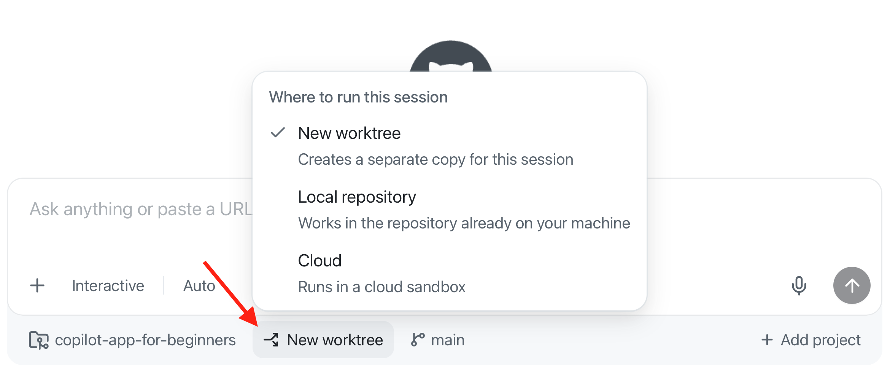
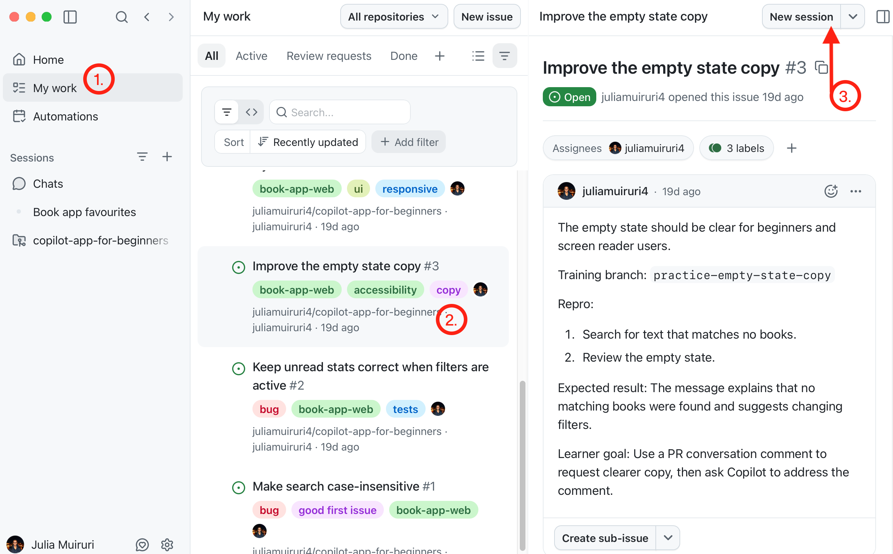
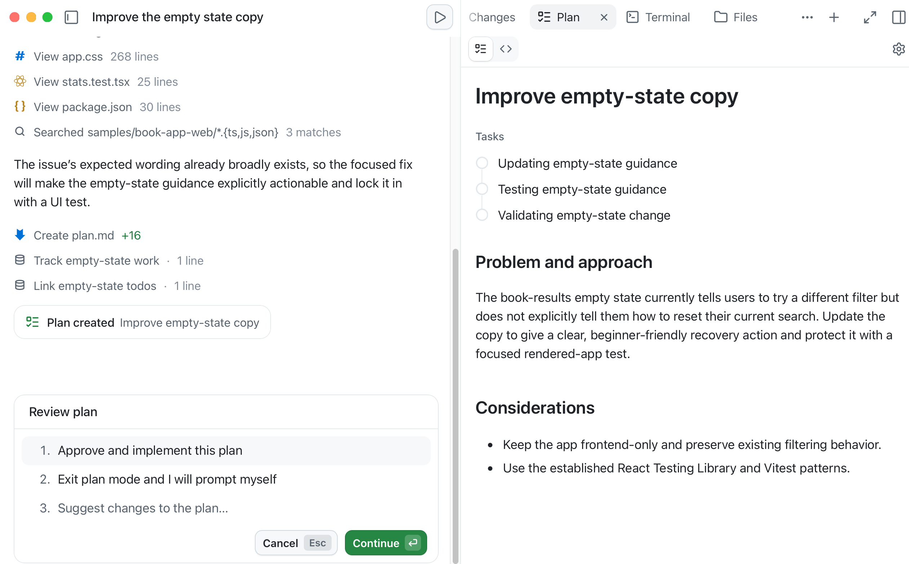
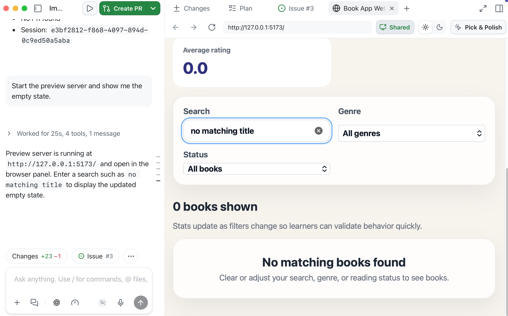
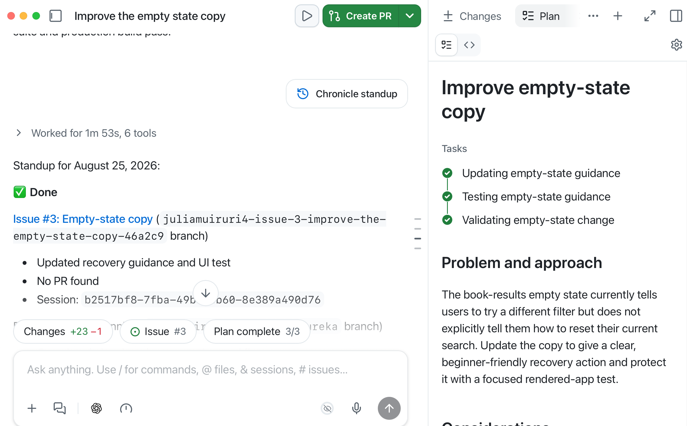
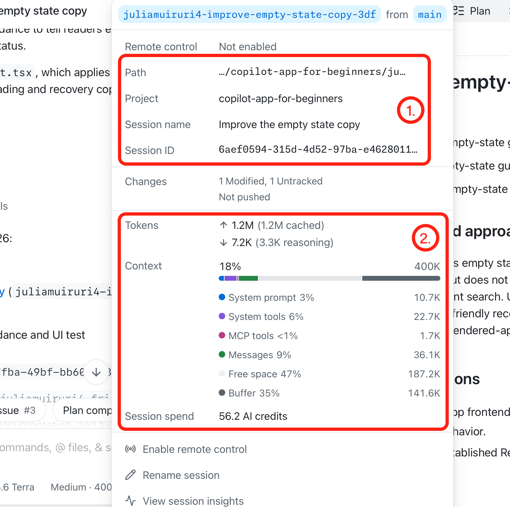

> **What if every task had its own workspace, branch, context and history?**

In Chapter 01 you saw the "shared working copy" problem: two agent tasks can blur together in one folder and branch. Sessions are where the GitHub Copilot app stops feeling like ordinary chat. A session can have its own branch, working folder, plan, diff, terminal output, browser preview, and GitHub context. In this chapter, you'll start a session from a task, learn how worktrees keep work separated, and practice giving GitHub Copilot proper context.

## Learning Objectives

By the end of this chapter, you'll be able to:

- Start a session from a prompt, issue or pull request
- Explain what a git worktree is and why you'd use it
- Understand why isolated sessions protect your main branch
- Use `@` for file and folder context, `#` for issue or PR context, and `/` for app commands
- Decide between working directly with a local repository, an isolated worktree, or a cloud sandbox

> ⏱️ **Estimated Time**: ~30 minutes

## Prerequisites

Complete Chapters [00](../00-setup/README.md) and [01](../01-tour-the-app/README.md). At this point, you've connected the course repository and understand the difference between chats and project sessions.

## 🧩 Real-World Analogy: One Studio, Many Recording Booths

Imagine one song that three musicians (vocalist, guitar, drums) need to record at the same time. To get the best results, you wouldn't crowd them around a single microphone and hope it works out. You'd put each one in their own soundproof booth to lay down a different part individually or possibly in parallel (to get more of that "live" feel), then mix the takes together later. This approach allows each recorded track to be edited and modified separately.


A worktree is like a separate recording booth. It's connected to the same repository (the same song), but it has its own folder and branch so parallel work doesn't collide.

## Core Concepts

### What Is a Git Worktree?

A **Git worktree** lets you create additional working directories for the same repository. Each worktree is usually checked out to a different branch (or commit). 

This allows you to work on multiple tasks or branches simultaneously without stashing changes or constantly switching branches in a single folder.

### Why the GitHub Copilot app uses worktrees

| Without isolation | With a worktree-backed session |
|---|---|
| Multiple tasks can edit the same folder | Each task gets a separate folder |
| Easy to lose track of branch state | Session branch is visible in the app |
| Tests and diffs can mix together | Diffs stay tied to the session |
| Harder to compare work | Easier to inspect and approve |


### Running Multiple Sessions in Parallel

Because each session works in its own worktree, you can run several at once without them colliding: one session fixing a bug while another explores a different branch, each with its own folder and diff. This is the real payoff of worktrees. An optional advanced section in [Chapter 03](../03-development-workflows/README.md) covers parallel sessions and `/orchestrate` if you want that later.

### Where a Session Runs

When you start a session, the composer's **Workspace** selector lets you choose *where* the work happens.



The choices trade off speed against isolation:

| Workspace | What it means | Choose it when... |
|---|---|---|
| New worktree | The session gets its own folder and branch beside your clone | You want changes, branches, and diffs kept separate from your main checkout (the safe default this course uses) |
| Local repository | The session works directly in your existing clone, with no separate folder | You want a quick, low-stakes look and don't mind the session touching your working folder |
| Cloud | The session runs in a cloud sandbox on GitHub's hosted infrastructure instead of your machine | You want to offload the work or keep your local environment untouched |


> Tip: When in doubt, choose a new worktree. It keeps your `main` checkout clean while still running on your machine, which is why the rest of this course leans on worktree-backed sessions.

Worktrees separate **files and branches**. They do not separate everything on your machine. Dev servers, databases, and ports can still collide if two sessions use the same ones. When you run more than one app preview later, use different ports.

### Session Settings That Matter Here

Before you run multiple sessions, find the app's session settings you toured in Chapter 01:

| Setting | Why it matters |
|---|---|
| Branch prefix | Makes app-created session branches easier to recognize. Uses `%username%-` as the default prefix |
| App instructions | Settings → **Sessions** → **Instructions**. These apply to every session across projects |

### Context Syntax

The GitHub Copilot app lets you attach context in the composer with `@`, `#` and `/`.

| Syntax | Use it for | Example |
|---|---|---|
| `@` | Files or folders | `@samples/book-app-web/src` |
| `#` | Issues or pull requests | `#12` |
| `/` | Slash commands | `/chronicle standup` |
| `&` | Other sessions, when the composer offers it | Type `&` and pick a session from the list |

You'll use `@`, `#`, and `/` in this course. Treat `&` as optional. Use it later if you want one session to see what another session already worked on.

> Tip: Provide the smallest amount of useful context - less is often more.

### Slash Commands

Slash commands are shortcuts you type in the composer. They can open app utilities, invoke agent behaviors, inspect usage or trigger installed skills. The safest way to discover what your app supports is to type `/` in the composer and read the palette. Commands can vary by app version, enabled plugins, installed skills, and organization policy.

For this chapter, you only need `/chronicle` and `/context`.

| Command | What it's for | Use it when... |
|---|---|---|
| `/chronicle` | Summarizes session history and past work | You want a session recap or standup-style summary |
| `/context` | Opens session context and token usage details when available | You want to see how much conversation and file text the session is holding |

<details>
<summary>Key GitHub Copilot app Slash Commands</summary>

| Command | Description |
|---|---|
| `/agent` | Select or switch the active agent for a session. |
| `/chronicle` | Summarize session history, generate standups, search past work, or get workflow/cost tips. |
| `/collect-debug-logs` | Collect app logs for troubleshooting or filing GitHub Copilot app issues. |
| `/context` | Show session context details such as token usage (how much text the model is holding), context window size, and AI credit spend. |
| `/create-canvas` | Create a canvas from the current session for a richer editable/inspectable surface. |
| `/orchestrate` | Coordinate multi-session or multi-repo work by delegating to child sessions. |
| `/remote` | Work with remote-session/remote-control flows when available in your build. |
| `/research` | Conduct research on a topic or question and summarize the findings. |
| `/review` | Request a review of the current session or a specific piece of code. |
| `/rubber-duck` | Ask a critic agent to review a plan, diff, tests, design, or proposed approach. |
| `/skills` | Discover available skills; `/skills reload` reloads skills during a session. |
| `/usage` | Open usage, rate-limit, plan-limit, or credit information. |
| `/[skill-name]` | Invoke an installed skill directly, such as `/security-review`; available commands depend on installed skills. |

When in doubt, type `/` and use the in-app palette to discover what's available.

</details>

### Branches Used in This Course

Back in [Chapter 00](../00-setup/README.md), the setup script added several *practice branches* to your forked repository. As a quick refresher, each practice branch starts from your `main` branch and adds a small intentional change to the sample app in `samples/book-app-web`, usually a bug for you to fix, set up for one specific exercise later in the course. Because that change lives on its own branch, you can inspect or fix it in a safe, realistic way without touching `main` or the working app.

Each exercise names the branch it needs. For reference, here is the full set that you'll see in this course:

- `practice-search-case-bug`: book search is case-sensitive when it should match regardless of case
- `practice-unread-count-bug`: the unread stats count is wrong while a filter is active
- `practice-empty-state-copy`: the "no results" empty-state message needs clearer, friendlier copy
- `practice-card-polish`: a starting point for improving book card spacing and responsive layout
- `practice-failing-stats-check`: a stats test fails on purpose so you can practice fixing a failing CI check

When an exercise calls for you to use one of these branches, you'll use it to create your GitHub Copilot app session. You can do this by selecting the project's `Create from` icon in the sidebar (1) and then selecting the desired branch from the dialog (2).


Try it out!
1. Locate the **copilot-app-for-beginners** project in the sidebar.
2. Select the `Create from` icon next to the project name.
3. Notice that branches, PRs, and issues are available to select from the dialog.

There's no need to select anything quite yet. You'll do that in later exercises.

> Don't see the branches? You may have skipped the setup script, or you're on a different clone. Run it now from [Chapter 00](../00-setup/README.md#2-fork-clone-and-prepare-the-course-repository), or follow the manual steps in [appendices/training-github-scenarios.md](../appendices/training-github-scenarios.md).

## Exercise: Start a Session from an Issue

You'll start a new session directly from a GitHub issue, without leaving the app - a big time saver! Your forked repository already has seeded issues if you ran the setup script in [00 - Setup](../00-setup/README.md).

Perform these steps:

1. On the **My work** tab, find and click on **Issue 3: Improve the empty state copy** to read and understand the task (the exact number may differ if issues were reseeded - look for the matching title):

   

1. Click on **New session** at the top. The app starts a new session with the issue attached and `/issue-fix` slash command pre-populated.

1. In the session composer, set the **Mode** selector to **Plan**.

1. You can add your own instructions in the composer, or submit the prompt as is. Click **send**.

   Copilot should analyze the issue and generate a plan that you can review before making any changes. Notice that you can then approve and implement the plan using autopilot, exit plan mode and add your own prompts, or suggest changes to the plan.

   

1. Select `Exit plan mode and I will prompt myself` to exit plan mode and continue with your own prompts.

Now that you have a plan, you'll narrow the session's focus so Copilot edits only the relevant source files.

1. Submit this prompt:

   ```text
   Use @samples/book-app-web/src to focus on the React app code. Which files are most likely involved in the empty-state copy?
   ```
   > Tip: Manually type the `@samples/book-app-web/src` part of the prompt **then** click on the */samples/book-app-web/src* link in the composer to select the folder.

   Copilot will focus on the sample app source folder instead of referencing unrelated files or folders in the working directory and show a list of files that are likely involved in the empty-state copy. This narrowed context helps keep the session's context smaller and more relevant to the task.

1. Ask the agent to implement the plan: `Implement the plan`

   As Copilot works, you'll see real-time updates on the **Tasks list** on the **Plan** page. A **Changes** tab will show the diff of the files being modified.

## Review changes

1. Click on the *Changes* pill tab to see the diff of the files being modified.

1. Ask Copilot to start the preview server to test the changes. 

   ```
   Start the preview server.
   ```

   **Expected Output**: The preview server starts and opens a browser panel in the app. Type a random search term in the search box to see the empty state message. The message should now be more friendly and clear.

   

## Slash Commands

Slash commands are shortcuts you run in the composer. Here you'll use:

- `/chronicle` to get a quick recap of what the session has done so far. Adding the `standup` argument formats that recap as a short, standup meeting-style summary.
- `/context` to check how much context the session is using, as well as inspect the branch and worktree the session is running in.

Perform these steps:

1. In the session composer, make sure you're in the session you've been working in, submit the following slash command:

   ```text
   /chronicle standup
   ```

   **Expected Output**: Copilot should summarize what happened in the session and what decisions or changes were made.

   

1. Next, submit the following slash command to check the session's context usage & worktree details:

   ```text
   /context
   ```

   Note: Click on the **Context bar** to expand

   Context is the content the GitHub Copilot app is using for the current session. Checking it helps you know when a session is getting overloaded before you add more files, issues, or instructions.

   **Expected Output**: The GitHub Copilot app opens the session dialog to display session, context and usage information.

   

   1. This is where a session keeps its evidence of the **working branch** and the branch it branched from, the **worktree path**, the **project** the session is working in, the current **session name** and its assigned **session ID**. 
   1. The **Context usage** section shows how many **tokens** the session is using (both cached and reasoning tokens), the **context window usage so far** with granular distribution across the system prompt, tools, messages etc. and your current **AI credit spend** for the session.

---

## Troubleshooting

If a session folder, branch, or preview looks wrong, start with [appendices/git-worktrees.md](../appendices/git-worktrees.md) and the [Troubleshooting Reference](../appendices/troubleshooting-reference.md).

<details>
<summary>Session, worktree, and context problems</summary>

### I don't see the practice branches

Run the Chapter 00 setup script again, or follow [appendices/training-github-scenarios.md](../appendices/training-github-scenarios.md). Confirm you connected your fork, not the upstream course repo.

### The session edited the wrong folder

Open the session details and check the worktree path and branch name. Prefer a **new worktree** for course exercises.

### `/context` or `/chronicle` is missing

Type `/` and use the in-app palette. The official list is in [Slash commands for the GitHub Copilot app](https://docs.github.com/en/copilot/reference/github-copilot-app-reference/slash-commands).

### Two previews collided

Worktrees isolate files and branches, not ports. Stop one Vite server or start the second on port `5174`.

</details>

---

## Key Takeaways

1. Sessions are focused agent workspaces.
2. Worktrees keep session changes separate from your main checkout.
3. The workspace selector lets a session run in your local clone, a new worktree, or a cloud sandbox; a new worktree is the safe default.
4. Worktrees isolate files and branches, but not ports, databases, or background processes.
5. Run parallel sessions on different ports to avoid collisions.
6. `@`, `#`, and `/` help you control context and commands.
7. Slash commands can be used to quickly access features and information within the app.

---

## 📝 Assignment


Start a new Plan mode session for the following task:

```text
Investigate how samples/book-app-web calculates reading stats. Do not edit files. Explain which files are involved and what tests would prove the behavior.
```

Then answer:

1. What branch or worktree did the session use?
2. Which files did Copilot inspect or recommend inspecting?
3. What validation did Copilot suggest?
4. Did you keep the context focused?

---

## ➡️ What's Next

In the next chapter, you'll use isolated sessions for real development work. Part A covers the inner loop: review, debug, test, and browser preview. Part B covers the outer loop: My work, issues, pull requests, review comments, and checks.

**[← Back to Chapter 01](../01-tour-the-app/README.md)** | **[Continue to Chapter 03 →](../03-development-workflows/README.md)**

---

## Source References

- [About the GitHub Copilot app][about-app]
- [Working with agent sessions][agent-sessions]
- [Slash commands for the GitHub Copilot app][slash-commands]
- [GitHub Copilot app repository][app-readme]
- [GitHub Copilot app changelog][changelog]
- [GitHub Copilot app product blog][app-blog]

[agent-sessions]: https://docs.github.com/en/copilot/how-tos/github-copilot-app/agent-sessions
[slash-commands]: https://docs.github.com/en/copilot/reference/github-copilot-app-reference/slash-commands
[about-app]: https://docs.github.com/en/copilot/concepts/agents/github-copilot-app
[app-readme]: https://github.com/github/app
[changelog]: https://github.blog/changelog/2026-06-17-github-copilot-app-generally-available/
[app-blog]: https://github.blog/news-insights/product-news/github-copilot-app-the-agent-native-desktop-experience/
