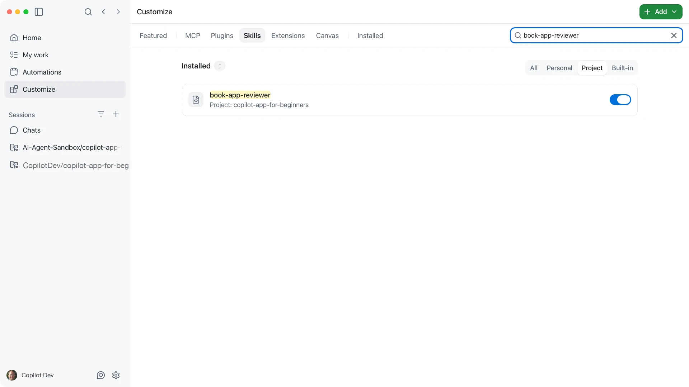
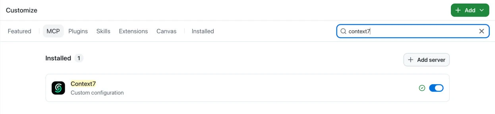
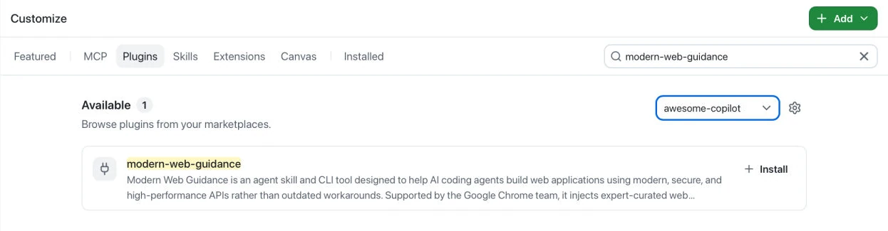

> **What if GitHub Copilot could follow your team's review checklist every time, without any new setup or access?**

Chapter 03 took a change from the first edit to a pull request. Along the way, you typed the same reminders more than once: keep the change small, run the tests, check the app in the browser. A [skill](../GLOSSARY.md#skill) stores that kind of guidance in the repository so Copilot can reuse it.

This chapter is hands-on with one repo-local skill. It also gives you a map of three other ways to extend the app: [Model Context Protocol (MCP)](../GLOSSARY.md#model-context-protocol-mcp-server) servers, [plugins](../GLOSSARY.md#plugin), and [custom agents](../GLOSSARY.md#custom-agent). You'll learn what each one adds and when to reach for it. You won't install any of them.

## Learning Objectives

By the end of this chapter, you'll be able to:

- Explain how a skill differs from a one-off prompt and from repository instructions
- Find a skill in the **Customize** tab and use it to compare a generic review with a skill-guided review of `samples/book-app-web`
- Describe when an MCP server, a plugin, or a custom agent fits better than a skill

> ⏱️ **Estimated Time**: ~30 minutes

## Prerequisites

Complete [Chapter 03](../03-development-workflows/README.md). Open the course repository in the GitHub Copilot app and use `samples/book-app-web` for the prompts.

## From the Studio: A Song Chart for the Session

The players already know their instruments. The bandleader still hands out a chart so everyone plays *this* song the same way.


A skill is that chart. It doesn't give Copilot a new instrument. It reminds Copilot how this repository wants a repeated task done.

## Core Concepts

### What a skill is

A skill is a folder that contains a `SKILL.md` file with task-specific instructions. Copilot loads the skill when a task matches its description or when you name it in a prompt.

Skills are one of four ways to extend the GitHub Copilot app:

| Extension | What it adds | In this chapter |
|---|---|---|
| Skill | Reusable guidance for one kind of task | Hands-on |
| MCP server | A connection to an external tool or live data source | Read about it |
| Plugin | A package that can bundle skills, agents, and MCP servers | Read about it |
| Custom agent | A specialized role you choose with `/agent` | Read about it |


All four are managed from the sidebar **Customize** tab. That tab also lists **Extensions** and **Canvas**. Canvases are the topic of Chapter 05, and the other extensions are outside this course.

> [!TIP]
> A skill changes how Copilot approaches a task. It doesn't give Copilot access to anything new. That's why it's the safest place to start.

### Where the course skill lives

The course includes a skill named `book-app-reviewer`:

```text
.github/
└── skills/
    └── book-app-reviewer/
        └── SKILL.md
```

The file starts with a short metadata block between two `---` lines, called YAML frontmatter. Copilot reads the `name` and `description` there to decide when the skill applies:

```markdown
---
name: book-app-reviewer
description: Review changes in samples/book-app-web for accessibility, responsive layout, tests/build validation, and small beginner-safe changes.
---
```

The rest of the file is a checklist: keep the stack unchanged, run the tests and build, check accessibility and responsive layout, and keep changes small.

Because the skill lives in `.github/skills`, it's version-controlled, reviewable in a pull request, and free of API keys. Skills can live in other locations too, including personal skill folders on your machine. See [About agent skills][agent-skills] for the full list.

### Skill versus instructions versus a one-off prompt

Chapter 03 showed that Copilot reads more than your prompt. This repository's `.github/copilot-instructions.md` file holds always-on house rules: the stack, the validation commands, and the reminder to keep changes small. A skill adds guidance for *one kind of task* on top of those rules.

| | Lives where | When it applies | Best for |
|---|---|---|---|
| One-off prompt | The current session | When you type it | A one-time request |
| Repository instructions | `.github/copilot-instructions.md` | Always, for this project | Stable project rules |
| Skill | `.github/skills/<name>/SKILL.md` | When the task matches, or when you name it | A repeated checklist |


Instructions are the house rules. A skill is the chart for one kind of song.

## Exercise: Compare a Generic Review with a Skill-Guided Review

You'll confirm the skill is available, then send the same review request twice in two separate places: once in a chat without the skill, and once in a project session with it. Keeping the requests identical apart from the skill name is what makes the comparison fair. Don't edit any files in `samples/book-app-web`.

1. In the sidebar, select **Customize**, then **Skills**. Filter to **Project** and search for `book-app-reviewer`. Confirm it's listed and enabled. The filters show where each skill comes from: **Personal** skills live on your machine, **Project** skills live in the repository, and **Built-in** skills ship with the app. If you clear the search, you'll also see a few project skills the course authors use for screenshots and diagrams. Ignore those.

   

1. Open `.github/skills/book-app-reviewer/SKILL.md` in your editor and read the **Review focus** list. It has six items. You'll ask Copilot which of them it applied. If you'd rather stay in the app, attach the file with `@` in a chat and ask Copilot to show you the list.

1. Select the **+** next to **Chats**, pick the `copilot-app-for-beginners` repository, and send the generic review request:

   ```text
   Review @samples/book-app-web/src for one small accessibility improvement to the results area (the "books shown" heading and the empty state). Don't edit files yet.
   ```

   Note what the reply focuses on and whether it mentions tests or the browser.

1. Select **Create from** next to the course project and start a new worktree session from `main`. Set the mode to **Plan**, then send the same request with the skill named:

   ```text
   Use the book-app-reviewer skill. Review @samples/book-app-web/src for one small accessibility improvement to the results area (the "books shown" heading and the empty state). Don't edit files yet.
   ```

1. In the same session, ask:

   ```text
   Which items from the book-app-reviewer skill's Review focus list did you apply?
   ```

   **Expected Output:** The plan should reflect the checklist in `SKILL.md`. Look for:

   - A single small change in `src/App.tsx`, `src/styles/app.css`, or a test file
   - Accessibility language from the skill, such as labels, region names, keyboard-friendly controls, or useful empty states
   - The validation commands `npm test -- --run` and `npm run build`
   - A list of the checklist items Copilot applied

   The generic reply may cover some of these. The skill-guided reply should cover them consistently, every time you use it.

1. Review the plan and stop there. You can implement it later if you want. For this chapter, seeing the skill shape the plan is the goal.

> [!NOTE]
> Skills don't always attach automatically. If a reply looks generic even after you name the skill, ask which checklist items it considered. Output also varies by model and app version, and commands such as `/skills` and `/agent` vary by build. Type `/` in the prompt box to see what yours offers. A different plan isn't a failed exercise.

> [!TIP]
> `/skills` lists the skills a session can use, and `/skills reload` picks up edits without starting a new session. Installed skills can also appear as slash commands, such as `/book-app-reviewer`.

## The Rest of the Map: MCP Servers, Plugins, and Custom Agents

You don't need to install anything in this section. The goal is to recognize each extension so you know what to reach for later.

### MCP servers

An MCP server connects Copilot to a tool or data source outside the repository, such as a documentation service, a design tool, or a browser automation tool. Open **Customize**, then **MCP** to browse featured servers and see any that are already configured. Your **Installed** list may be empty. That's fine.



Reach for an MCP server when a task needs live data or a tool that isn't in the repository. For GitHub issues and pull requests, the app's built-in GitHub integration already covers that. MCP servers often need authentication, and your organization may control which ones are allowed.

### Plugins

A plugin is an installable package that can bundle skills, custom agents, MCP servers, and other capabilities. Open **Customize**, then **Plugins** to browse them. Each installed plugin has a toggle so you can disable it without uninstalling it.



Reach for a plugin when someone has already packaged the skills and tools for a platform you use, such as a cloud provider.

### Custom agents

A custom agent is a specialized role with its own instructions and tool access, such as a dedicated reviewer or documentation writer. Choose one with `/agent` or the agent picker in the prompt box.

Custom agents are an advanced topic. A skill gives the default agent a checklist. A custom agent replaces the default agent with a different role. In this course, the `book-app-reviewer` skill covers the review role, so you won't need one.

### Give the agent only what it needs

More tools and context aren't automatically better. Every added tool is one more thing for Copilot to consider and one more thing for you to supervise. Start with repository context and a skill. Add an MCP server or plugin only when a task needs it, and disable what you don't use.


---

## Troubleshooting

If you're still stuck, see the [Troubleshooting Reference](../appendices/troubleshooting-reference.md).

<details>
<summary>Skill and extension problems</summary>

### The Skill Doesn't Seem to Apply

Confirm the file is at `.github/skills/book-app-reviewer/SKILL.md`, name the skill in your prompt, and start a new session if you edited the file.

### Copilot Gives Generic Advice

Mention `book-app-reviewer` and `@samples/book-app-web/src` explicitly, then ask which checklist items it considered.

### I Can't Find Skills, MCP, or Plugins in Settings

They're in the sidebar **Customize** tab. If your build shows a **Customize** entry inside Settings, it only points to the sidebar tab.

### An MCP Server or Plugin Isn't Working

Check its enabled toggle in **Customize**, any authentication it requires, and your organization's policy. Start a new session after making changes.

</details>

---

## Key Takeaways

1. A skill is reusable guidance for one kind of task. It changes how Copilot works, not what it can access.
2. Repository instructions are always-on house rules. A skill is a checklist that applies when the task matches or when you name it.
3. Skills, MCP servers, and plugins are managed from the sidebar **Customize** tab.
4. Start with repository context and a skill. Add MCP servers, plugins, or custom agents only when a task needs them.

## Assignment


Improve the `book-app-reviewer` skill on a branch, then use it.

1. In the sidebar, select **Create from** for the course project and start a new worktree session from `main`.
1. Set the mode to **Interactive** and submit:

   ```text
   Edit @.github/skills/book-app-reviewer/SKILL.md. Add two items to the Review focus list: headings must follow a logical order under a single h1, and every icon or image must have a text alternative. Keep the rest of the file unchanged.
   ```

1. Inspect the diff in the **Changes** tab, then submit:

   ```text
   Review @.github/skills/book-app-reviewer/SKILL.md for clarity. Is each item specific enough that a beginner would know what to check? Suggest wording changes only.
   ```

1. Ask Copilot to apply the wording changes you agree with, then inspect the diff again.
1. Run `/skills reload` so the session picks up the edited skill. If that command is missing, start a new session from this session's branch instead.
1. Set the mode to **Plan** and submit:

   ```text
   Use the book-app-reviewer skill to review @samples/book-app-web/src for one small heading or text-alternative improvement. Create a short plan and list which checklist items you applied. Don't edit files yet.
   ```

Success criteria: The plan cites at least one of the two rules you added (the book cards currently use the same heading level as the results heading, so expect that to come up), and you can explain why this chapter uses a repo-local skill instead of an MCP server, a plugin, or a custom agent.

Archive the session when you're done. Don't open a pull request unless you intend to contribute the change.

## What's Next

In the next chapter, you'll use canvases as a shared board for a session. You'll start with the built-in plan, terminal, and browser surfaces from Chapter 03, then run `/create-canvas` to keep the plan, checks, and next decision visible for work on `samples/book-app-web`.

**[← Back to Chapter 03](../03-development-workflows/README.md)** | **[Continue to Chapter 05 →](../05-canvases/README.md)**

---

## Source References

- [Customizing the GitHub Copilot app][customizing]
- [About agent skills][agent-skills]
- [Built-in skills for the GitHub Copilot app][built-in-skills]
- [About GitHub Copilot plugins][plugins]
- [Slash commands for the GitHub Copilot app][slash-commands]
- [GitHub Copilot app product blog][app-blog]

[customizing]: https://docs.github.com/en/copilot/how-tos/github-copilot-app/customize-github-copilot-app
[agent-skills]: https://docs.github.com/en/copilot/concepts/agents/about-agent-skills
[built-in-skills]: https://docs.github.com/en/copilot/reference/github-copilot-app-reference/built-in-skills
[plugins]: https://docs.github.com/en/copilot/concepts/agents/about-plugins
[slash-commands]: https://docs.github.com/en/copilot/reference/github-copilot-app-reference/slash-commands
[app-blog]: https://github.blog/news-insights/product-news/github-copilot-app-the-agent-native-desktop-experience/
