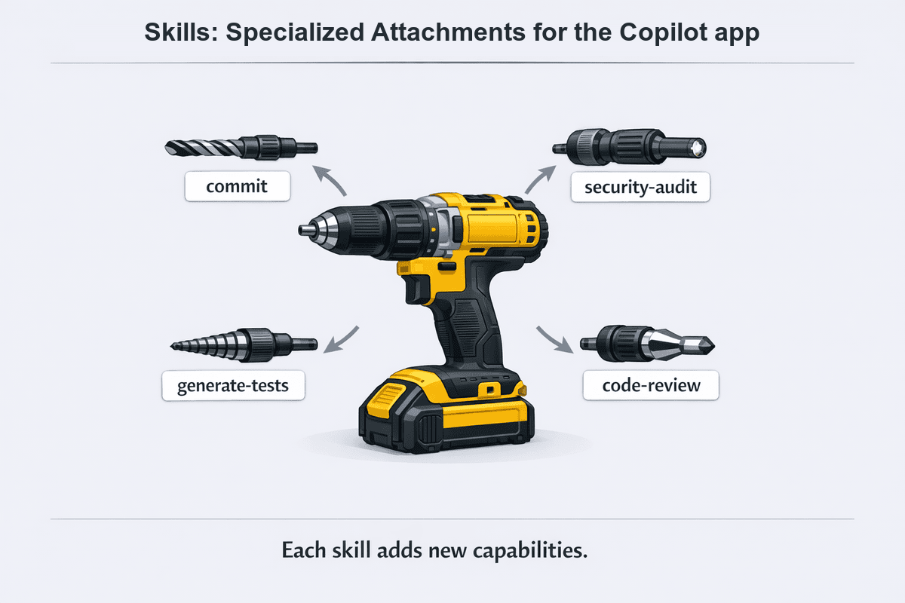
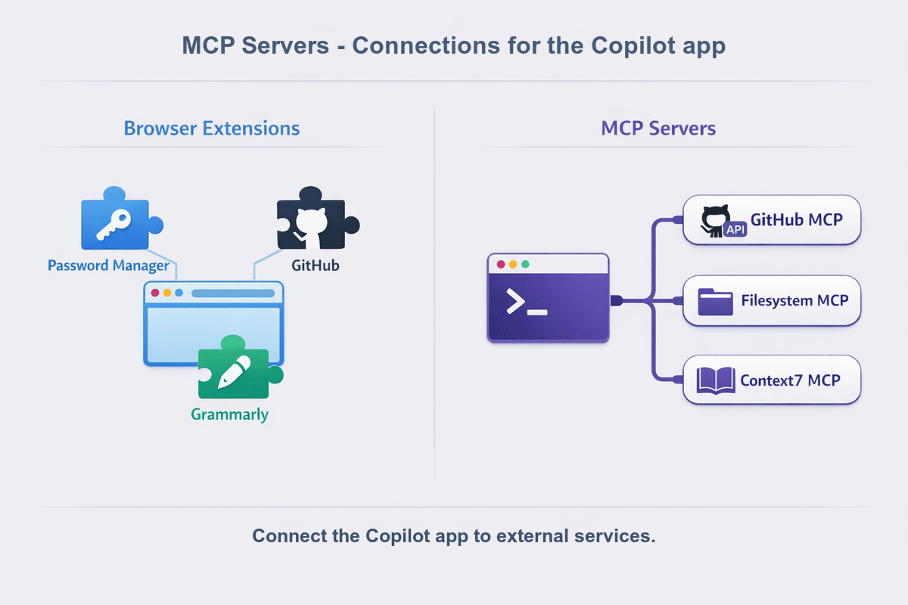
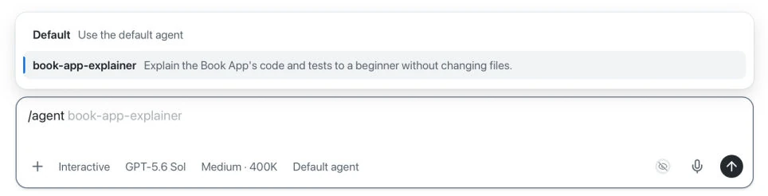

> **What if you could reuse your review checklist instead of typing the same reminders for each task?**

Chapter 03 connected a code change to its diff, tests, browser preview, and pull request. This chapter helps you reuse that workflow. You will start with a [skill](../GLOSSARY.md#skill) that stores review guidance for `samples/book-app-web`.

You will also learn when to use [Model Context Protocol (MCP) servers](../GLOSSARY.md#model-context-protocol-mcp-server), [plugins](../GLOSSARY.md#plugin), and [custom agents](../GLOSSARY.md#custom-agent). Each feature has a small example.

## Learning Objectives

By the end of this chapter, you'll be able to:

- Choose between repository instructions, a skill, an MCP server, a plugin, and a custom agent
- Find, update, and use the repository's `book-app-reviewer` skill
- Use an MCP server to check documentation, if your organization permits it
- Install a plugin and use one of its skills for a focused task, if permitted
- Create and select a custom agent that can read and explain the sample without editing it

> ⏱️ **Estimated Time**: ~75 minutes

## Prerequisites

Complete [Chapter 03](../03-development-workflows/README.md). Use your course fork and the Node.js setup from Chapter 00. You do not need to merge any practice pull requests.

The skill and custom-agent exercises use local files. The Context7 exercise needs internet access and permission to add an MCP server. The plugin exercise also needs permission to install a plugin. Do not change organization policies to complete an exercise. No cloud-provider subscription or deployment is required.

## From the Studio: A Song Chart for the Session

The players already know their instruments. The bandleader still hands out a chart so everyone plays *this* song the same way.


A skill is that chart. It gives the Copilot app instructions for a repeated task. An MCP server gives the Copilot app access to tools and data. A plugin packages capabilities for reuse, and a custom agent defines a specialist's role.

You still check the result. A chart does not guarantee a good performance.

## Core Concepts

### Choose the feature that fits the task

These features solve different problems. You do not need all four for each task.

| Feature | What it adds | Example in this chapter |
| --- | --- | --- |
| Skill | Instructions and resources for a repeated task | Update and apply a book-app review checklist |
| MCP server | Tools that connect the Copilot app to a service or data source | Check React's input-label guidance with Context7 |
| Plugin | An installable package of skills, agents, or other capabilities | Use Modern Web Guidance to plan a small CSS improvement |
| Custom agent | A named role with instructions and a selected set of tools | Create a read-only book-app explainer |


Find skills, MCP servers, and plugins in the sidebar **Customize** tab. Select custom agents with `/agent` or the agent picker in the prompt box. **Canvas** is the topic of Chapter 05.

### Skill versus instructions versus a one-off prompt

The repository's `.github/copilot-instructions.md` file gives the Copilot app project-wide rules. A skill adds instructions for one kind of task.

| Guidance | Where it lives | When it applies | Best for |
| --- | --- | --- | --- |
| One-off prompt | The current conversation | When you send it | A single request |
| Repository instructions | `.github/copilot-instructions.md` | Across tasks in this project | The stack, file locations, and project rules |
| Skill | `.github/skills/<name>/SKILL.md` | When the task matches its description or you invoke it | A repeated workflow |


Instructions are the house rules. A skill is the chart for one kind of song.

> [!IMPORTANT]
> A skill is not a permission boundary. Skills can include scripts or tell the Copilot app to use tools. Read unfamiliar skills before you enable them. The course review skill contains instructions only.

## Create a Practice Session

1. Select **Create from** next to your course project.
2. Select **Branches**, then `main`, to start a session in a new worktree.
3. Set the mode to **Interactive**.
4. Submit the following prompt:

   ```text
   Show this session's branch and worktree path. Confirm that .github/skills/book-app-reviewer/SKILL.md and samples/book-app-web exist here. Do not edit files, commit, or push.
   ```

Keep this session for all the exercises. When you open a file in your editor, use the session's worktree, not the original clone.

**Expected Output:** The session shows a worktree path separate from your original clone and finds both paths.

> [!NOTE]
> File edits belong to this worktree. Installed tools can have a wider scope and affect other sessions. A new worktree from `main` will not contain uncommitted edits from this session.

## Skills: Save a Review Checklist

A drill can do different jobs with different attachments. Skills work in a similar way: they give the Copilot app reusable instructions for specific tasks. For the Book App, the `book-app-reviewer` skill supplies the review checklist.



The skill names in the graphic are examples. This exercise uses `book-app-reviewer`.

Start with the review skill you found in the practice session. A skill is a folder with a `SKILL.md` file. The course includes one at:

```text
.github/skills/book-app-reviewer/SKILL.md
```

The file starts with metadata between two `---` lines. This block is called **YAML frontmatter**. The `description` helps the Copilot app decide when to load the skill:

```markdown
---
name: book-app-reviewer
description: Review changes in samples/book-app-web for accessibility, responsive layout, tests/build validation, and small beginner-safe changes.
---
```

The Markdown below the frontmatter contains the instructions. This skill covers the stack, tests, build, accessibility, responsive layout, and change size.

Repository skills can be shared through Git. Personal skills apply across projects on your machine. See [About agent skills][agent-skills] for the supported locations.

### Exercise: Update and Use the Course Skill

You will add two specific review rules, then use the updated skill. You will not change the sample app yet.

HTML heading levels (`h1`, `h2`, and `h3`) describe the page structure, not just text size. Text alternatives convey the meaning of images and icons to people who cannot see them. A screen reader can read these alternatives aloud.

1. Select **Customize**, then **Skills**. 

1. Filter to **Project** and search for `book-app-reviewer`.

1. Confirm that the skill is enabled for the course project. Ignore the course-authoring skills.

    - **Personal** means skills stored in your home directory and available across projects
    - **Project** means repository skills
    - **Built-in** means skills supplied with the app.

   

1. Return to your chapter session and submit:

   ```text
   Read @.github/skills/book-app-reviewer/SKILL.md. Explain the frontmatter and summarize the Review focus list. Do not edit files or run checks.
   ```

1. Submit this bounded edit request:

   ```text
   Edit only @.github/skills/book-app-reviewer/SKILL.md. Append these two items to Review focus:

   - Check that headings describe the page structure: one page-level h1, section headings below it, and book titles below the results heading.
   - Check that informative images and icons have text alternatives. Decorative images should use empty alt text, and decorative icons should be hidden from assistive technology.

   Keep all existing rules and frontmatter unchanged. Do not edit the sample app, commit, or push.
   ```

1. Inspect the **Changes** tab. Confirm that only the two rules were added to `SKILL.md`.

1. Submit `/skills reload` to load the edited skill.

1. Set the mode to **Plan** and submit:

   ```text
   Use the book-app-reviewer skill to inspect @samples/book-app-web/src. Focus on the results heading, book-title headings, and empty state.

   Apply the two rules we added. Propose at most one small improvement and name the files it would affect. If no change is needed, explain why.

   List the review rules you applied. Separate code observations from tests or browser checks that still need to run. Do not edit files or run commands.
   ```

1. Expand the skill activity in the response and confirm that the Copilot app loaded `book-app-reviewer`. Compare the plan with the rules in the file. Stop before implementation.

**Expected Output:** The plan cites the added heading or text-alternative rules and points to specific code. In the original sample, the book titles and results heading both use `h2`. If the Copilot app proposes `h3` for book titles, its plan must also account for the `.book-card h2` CSS selector. The plan must not claim that tests or browser checks passed.

**How It Works:** The changed file supplies a reusable checklist. Naming the skill makes your intent explicit. It does not guarantee correct findings. Check the activity and the code, not only the Copilot app's statement that it followed the rules.

> [!TIP]
> Type `/` to find available commands. The skill should appear as `/book-app-reviewer`. A general review prompt can also load a matching skill automatically, so different answers are not proof that one review used a skill and another did not.

The checklist gives the Copilot app review instructions. For a review that needs React documentation, an MCP server can supply that information.

## MCP Servers: Get Information from Another Service

A browser extension can connect your browser to a service, such as a password vault. An MCP server gives the Copilot app a similar connection to tools and data. Here, Context7 provides access to React documentation.



Model Context Protocol defines how an AI application connects to tools and data. An **MCP server** supplies those tools. The server can run on your machine or at a remote service.

The graphic shows example connections, not required installations. The app already has tools to read and search local files. Configure MCP connections under **Customize > MCP**, not the app's **Extensions** tab.

Use MCP when the task needs information or actions that the current tools do not supply. You do not need to add another GitHub server for the issue and pull request work from Chapter 03.

[Context7][context7] is a documentation service with an MCP server. In this example, it supplies React documentation. It does not become a dependency of the Book App.


The screenshot shows one Context7 connection after setup. Your **Installed** list can be empty before this exercise. Use one connection per service.

### Exercise: Check the Book App's Input Labels with Context7

In React, a label's `htmlFor` value can match an input's `id` to connect the label to that input.

Start by getting the Context7 MCP server configured in the GitHub Copilot app.

1. Open **Customize**, then **MCP**.
2. Take a moment to look through the content in the **MCP** configuration screen.
3. Select **Add server** and locate **Context7**.
4. Take a moment to explore the values in the configuration dialog:

   | Setting | Value |
   |---|---|
   | Server name | `context7` |
   | Transport | `HTTP` |
   | URL | `https://mcp.context7.com/mcp` |

   > NOTE: HTTP means the Copilot app connects to a hosted server instead of starting a local process.

   

1. Select **Add server**.

1. Confirm that the connection is enabled and connected in the **Installed** view under **Customize**.
2. Return to the chapter session you created earlier. Switch to **Interactive** mode.
3. Submit the following prompt:

   ```text
   Use the Context7 MCP tools to find the official React documentation for input labels.

   Ask only this general question: How do nested labels compare with htmlFor and id when labeling an input?

   Summarize both patterns and include the source links. Do not send repository code or paths to Context7. If the MCP tools are unavailable, report that and stop.
   ```

1. Expand the tool activity. Confirm that a **Context7** tool returned documentation. Open a source link and compare it with the summary.
2. Submit the following prompt:

   ```text
   Compare the retrieved guidance with @samples/book-app-web/src/components/BookFilters.tsx. Keep this comparison local. Explain whether Search, Genre, and Status have associated labels. Do not edit files or make more external requests.
   ```

**Expected Output:** The MCP activity contains documentation results. The local comparison identifies the inputs and selects nested inside `<label>` elements. Missing `htmlFor` is not a defect when a control is inside its label. No source files should change.

## Plugins: Use a Packaged Capability

You can add skills and MCP servers separately, or install them as part of a **plugin**. A plugin can include skills, custom agents, MCP servers, or canvas extensions (more on those later in the course). A **marketplace** is a catalog of plugins. Installing a plugin is different from invoking one of the skills or agents inside it.

Choose a maintained plugin that provides the capability you need. Read its contents, not only the marketplace description. Some plugins start processes, call services, or run hooks, which are commands triggered by agent events.

### Exercise: Plan a CSS Improvement with Modern Web Guidance

The `modern-web-guidance` plugin from [GoogleChrome/modern-web-guidance][modern-web-guidance] supplies a skill that searches web-platform guides. You will use it for one book-title layout question, not a redesign. This exercise does not require the Context7 exercise.

The skill uses `npx` to download and run its documentation tool. Node.js and internet access are required. Review the [skill instructions][modern-web-skill] and any command approval before use.

1. Select **Customize**, then **Plugins**.
2. Search for `modern-web-guidance`. Use the marketplace filter to select `awesome-copilot`. If that marketplace is missing and your policy permits it, use the gear icon beside the filter to add `github/awesome-copilot`.

   

1. Confirm that the plugin's source is `GoogleChrome/modern-web-guidance`. Review the plugin's description, then select **Install**.
2. Confirm that the plugin is enabled in the **Installed** view under **Customize**.
3. Return to the project session in **Interactive** mode. Submit `/skills reload`, then type `/` and select the installed `modern-web-guidance` skill. The displayed command can include a plugin prefix. Add this prompt:

   ```text
   Use the modern-web-guidance skill from the installed plugin. Look up guidance for wrapping a short heading across multiple lines. Use only general terms in external queries.

   Then inspect @samples/book-app-web/src/components/BookCard.tsx and @samples/book-app-web/src/styles/app.css locally. Propose at most one CSS-only improvement for long book titles on narrow screens.

   Name the guide used, explain browser support, and give a browser check. Keep the current design and dependencies. Do not add JavaScript, change files, or run app checks. If the current CSS needs no change, explain why. If the plugin skill is unavailable, stop.
   ```

1. Inspect the skill activity and its guide-search output. Confirm that the recommendation refers to the current book-title element and CSS. A recommendation such as `text-wrap: balance` must explain what happens in browsers that do not support it.

**Expected Output:** The Copilot app loads the plugin's skill and retrieves a relevant guide. It returns a small CSS proposal or a reason to keep the existing layout. The Book App files remain unchanged.

## Custom Agents: Define a Role and Its Tools

A plugin can supply a custom agent, but you can also create your own. Agents are similar to specialists. 

For example, if you need to make repairs to your house, you choose a specialist based on the job:

| Job | Specialist | Why |
| --- | --- | --- |
| Repair a leaking pipe | Plumber | Knows plumbing requirements and has the right tools |
| Replace electrical wiring | Electrician | Knows electrical safety requirements |
| Install a new roof | Roofer | Chooses materials for the local weather |

Custom agents apply the same idea to code review, testing, security, and documentation. Define the instructions once, then select that agent when you need its specific role.


A **custom agent** has a name, instructions, and a set of available tools. A skill supplies a workflow to an agent; a custom agent defines the role that performs work. Custom agents are not a different session mode or necessarily a different AI model.

For example, a reviewer may need a checklist and test tools. An explainer only needs to read and search files. You will create that smaller role here.

The agent profile is a Markdown file with YAML frontmatter, like a skill:

| Profile part | Purpose |
| --- | --- |
| `name` | Identifies the agent in the agent picker |
| `description` | Describes the agent's purpose |
| `tools` | Limits the available tools; `read` and `search` allow file inspection without editing or running commands |
| Markdown below the frontmatter | Defines the agent's behavior and answer format |

### Exercise: Create a Read-Only Book App Explainer

1. Return to the chapter session in **Interactive** mode with the default agent selected.
2. Copy the instruction and the complete Markdown block into one message, then send it:

   ```text
   Create .github/agents/book-app-explainer.agent.md with exactly the Markdown below. Create the agents folder if it is missing. If the file exists, show it and stop instead of replacing it. Do not edit other files, commit, or push.
   ```

   ```markdown
   ---
   name: book-app-explainer
   description: Explain the Book App's code and tests to a beginner without changing files.
   tools: ["read", "search"]
   ---

   Explain files in samples/book-app-web.
   Read the relevant code before answering. Do not guess from file names.
   Use short sentences and define new technical terms.
   Do not edit files, run commands, or use external services.
   Do not claim that tests passed; you can inspect tests but cannot run them.

   Structure each answer as:
   1. What it does.
   2. How the data moves, with file paths and function names.
   3. One small example from the current book data.
   4. What the existing tests cover and one useful manual check.
   ```

1. Inspect the new file in **Changes**. Confirm that `tools` contains only `read` and `search`.
2. Type `/agent` in the prompt box.
3. Select **book-app-explainer** from the agent list, then send the completed `/agent book-app-explainer` command. Confirm that the agent picker below the prompt box shows `book-app-explainer`. If it is not listed, follow [A Changed Skill or New Agent Is Missing](#a-changed-skill-or-new-agent-is-missing), then try again.

   

   The screenshot shows the selection before the command is sent, so the agent picker still shows **Default agent**.

1. With the agent selected, submit:

   ```text
   Explain how @samples/book-app-web/src/App.tsx keeps reading statistics aligned with filtered books. Use the Unread filter as your example. Follow your four-part answer format.
   ```

1. Compare the answer with `App.tsx`, `ReadingStats.tsx`, and the existing tests. Confirm that the agent did not change files or run commands.
2. Use `/agent` or the agent picker to return to the default agent before the assignment.

**Expected Output:** The answer traces `filters` through `filterBooks` to `filteredBooks`, then shows how that list reaches `ReadingStats` and the book cards. It separates test coverage from a suggested manual check. No files change after the profile is created.

**How It Works:** The Markdown defines the role and answer format. The `tools` list limits available tools; omitting it would allow all available tools. The folder scope in the instructions guides the agent, but it is not a file-system sandbox.

This agent cannot run the tests or save its own report. That restriction is intentional. Use the default agent when you need those actions.

## Give the Agent Only What It Needs

The explainer needs only read and search tools. Apply that same approach when you choose skills, MCP servers, or plugins: start with project context and the smallest useful customization. Review tool approvals and external requests. Do not add broad access only to finish a course exercise.


After these exercises, you should have:

- An updated `book-app-reviewer` skill with your added review rules.
- A comparison of the Book App's input labels with React documentation retrieved through Context7.
- CSS advice from the Modern Web Guidance skill: one proposed change for long book titles, or an explanation of why no change is needed.
- A `book-app-explainer` custom-agent profile that limits the agent to read and search tools.

---

## Troubleshooting

<details>
<summary>Skill, MCP, plugin, and custom-agent problems</summary>

### A Changed Skill or New Agent Is Missing

Confirm that you saved the file in this session's worktree. Check the path and YAML frontmatter. For skills, try `/skills reload`. For a new agent or a missing reload command, wait for active work in all sessions to finish. Quit and reopen the GitHub Copilot app, then return to the same session. Closing a window is not the same as quitting the app. Do not start from `main` again to reload uncommitted files.

### Generic Advice from the Copilot app

Invoke the skill from the `/` menu or name it explicitly. Expand the activity to see whether it loaded. Ask for file-specific evidence and the rules applied. Different wording alone does not show whether the skill worked.

### I Cannot Find Skills, MCP, or Plugins in Settings

Use the sidebar **Customize** tab. Custom agents are selected with `/agent` or the prompt-box agent picker. Labels and available commands can vary by app version.

### An MCP Server Is Enabled but Its Tools Fail

Check the connection status, URL, authentication, network access, and organization policy. An enabled toggle alone does not prove that a server is connected. Use one connection per service. If the service reports a rate limit, wait or use its approved authentication process. Do not put credentials in prompts or repository files.

### A Plugin Is Installed but Its Skill Is Missing

Check the plugin's enabled toggle and current contents. Run `/skills reload`, then search the `/` menu for the skill name, including any plugin prefix. Use the same-session restart steps if needed. If the plugin no longer supplies the skill, record the exercise as blocked rather than installing an unrelated plugin.

### The Custom Agent Cannot Run Tests

The example permits only reading and searching. Return to the default agent to run commands. Do not add shell access just to make the read-only exercise work.

</details>

---

## Key Takeaways

1. Repository instructions give the Copilot app shared rules for work across a project. Skills provide reusable instructions for specific tasks, such as code review, that the Copilot app can load when needed.
2. An MCP server provides tools that let the Copilot app retrieve information or perform actions through connected services. Review what each tool can do and what data it sends to external services.
3. A plugin lets you install related skills, custom agents, or MCP servers together. Review its contents before installation. Installing a plugin does not automatically run its skills or agents.
4. A custom agent defines a specialist role within the Copilot app, with its own instructions and available tools. Match its tools to its task: an agent that only explains code needs read and search tools, not editing or shell access.
5. Do not rely only on the Copilot app's statement that it used a customization or completed a task. Check its activity and results against the files. For code changes, run tests and inspect the app.

## Assignment


The exercises stopped at review and explanation. Now use one reviewed recommendation to complete the Chapter 03 inner loop.

1. Stay in the same worktree with the default agent. Choose the skill's heading recommendation or the plugin's CSS recommendation. If neither identified a needed change, choose a focused test for the current heading structure.
2. Set the mode to **Plan** and submit:

   ```text
   Use the book-app-reviewer skill. Plan only the recommendation I select from this chapter. Name the source, CSS, and test files it affects. Preserve filtering, statistics, and the existing design. Include test, build, and browser checks. Do not implement yet.
   ```

   Add the specific recommendation to the prompt before you send it.

1. Before implementation, open **Terminal** in the review panel. From the session's repository root, run:

   ```bash
   cd samples/book-app-web
   npm install
   npm test -- --run
   npm run build
   ```

   If this worktree already has its dependencies, skip `npm install`. If you are already in `samples/book-app-web`, do not repeat `cd`. Record the test count and build result. Stop if either command fails; resolve the baseline problem before changing the app.

1. Review the plan, switch to **Interactive**, and ask the Copilot app to implement only that change. Do not approve unrelated refactoring or new dependencies.
2. Inspect **Changes**, then rerun `npm test -- --run` and `npm run build` from `samples/book-app-web`. Confirm that the tests and build pass without weakening existing tests.
3. Start the app with `npm run dev`. Open its **Local** URL in the review panel's **Browser** tab. Check the changed headings or wrapping at desktop and narrow widths. For a heading change, ask the Copilot app to inspect the rendered heading levels; appearance alone does not show heading structure.
4. Search for `hobbit`, then `zzzz-no-match`. Confirm that the first search shows **The Hobbit** and the second shows no books. The statistics must match each result, and the empty-state message must mention changing the search term, genre, or reading status.
5. Stop the development server with `Ctrl+C` in its terminal.
6. Ask the default agent to save a short record:

   ```text
   Create samples/book-app-web/docs/chapter-04-review.md. If it exists, update it without removing prior notes.

   Record the skill rules applied, the custom agent's role and tool limits, the change made, and the commands and browser checks actually completed. Include source links from the documentation comparison and the guide from the plugin exercise. If an exercise was blocked, record the reason instead of claiming it ran. Mark unperformed checks clearly.

   Change only this document. Do not commit or push.
   ```

**Success criteria:** Your diff contains the skill update, agent profile, one focused app or test change, and the review record. Tests and the build pass. You can explain what each customization adds and which ones you did not need.

If you want to keep this work, review the full diff before you use the Chapter 03 pull request workflow. Otherwise, leave it as practice. Save anything you need before archiving the session. Disable only the MCP connections or plugins you added for this exercise; leave pre-existing tools unchanged.

## What's Next

You now have reusable review instructions and a small read-only agent. You also know how to inspect tool connections and plugins before use.

In Chapter 05, you will use a canvas to keep a session's plan, checks, and next decision visible. The review record from this chapter shows the kind of evidence that belongs on that board. Chapter 05 does not require you to keep the MCP server or plugin enabled.

[**← Back to Chapter 03**](../03-development-workflows/README.md) | [**Continue to Chapter 05 →**](../05-canvases/README.md)

---

## Source References

- [Customizing the GitHub Copilot app][customizing]
- [About agent skills][agent-skills]
- [Adding MCP servers for Copilot CLI (also used by the app)][mcp-setup]
- [Context7 source and setup][context7]
- [React: Providing a label for an input][react-input-label]
- [About GitHub Copilot plugins][plugins]
- [Modern Web Guidance source][modern-web-guidance]
- [Creating and using custom agents for Copilot CLI][custom-agents]
- [Custom-agent configuration and tool aliases][agent-config]
- [Slash commands for the GitHub Copilot app][slash-commands]

[customizing]: https://docs.github.com/en/copilot/how-tos/github-copilot-app/customize-github-copilot-app
[agent-skills]: https://docs.github.com/en/copilot/concepts/agents/about-agent-skills
[mcp-setup]: https://docs.github.com/en/copilot/how-tos/copilot-cli/customize-copilot/add-mcp-servers
[context7]: https://github.com/upstash/context7
[react-input-label]: https://react.dev/reference/react-dom/components/input#providing-a-label-for-an-input
[plugins]: https://docs.github.com/en/copilot/concepts/agents/about-plugins
[modern-web-guidance]: https://github.com/GoogleChrome/modern-web-guidance
[modern-web-skill]: https://github.com/GoogleChrome/modern-web-guidance/blob/main/skills/modern-web-guidance/SKILL.md
[custom-agents]: https://docs.github.com/en/copilot/how-tos/copilot-cli/customize-copilot/create-custom-agents-for-cli
[agent-config]: https://docs.github.com/en/copilot/reference/custom-agents-configuration
[slash-commands]: https://docs.github.com/en/copilot/reference/github-copilot-app-reference/slash-commands
