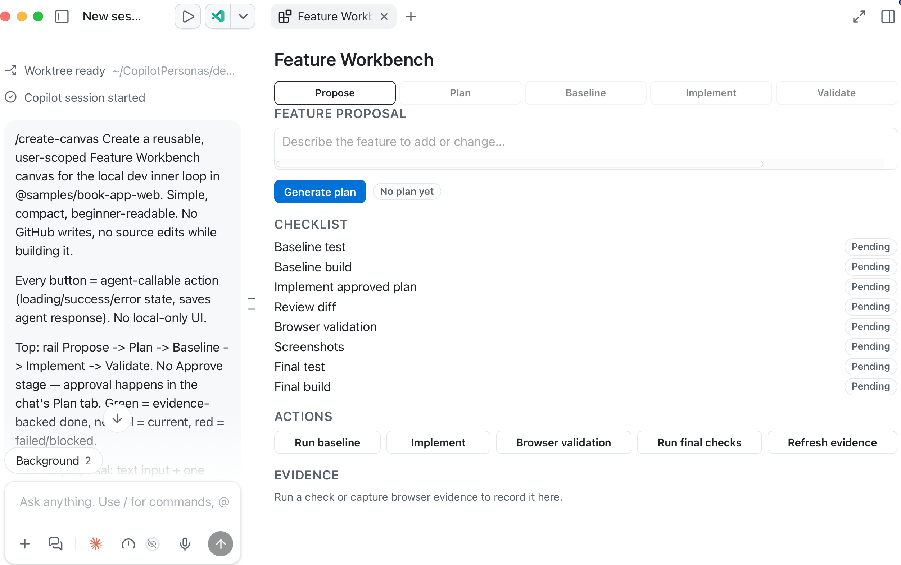
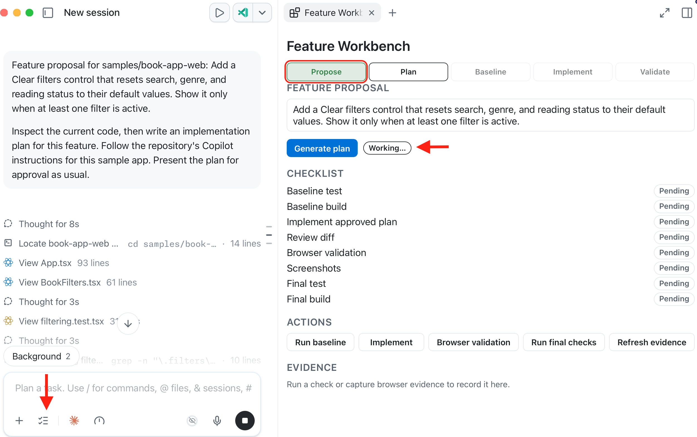
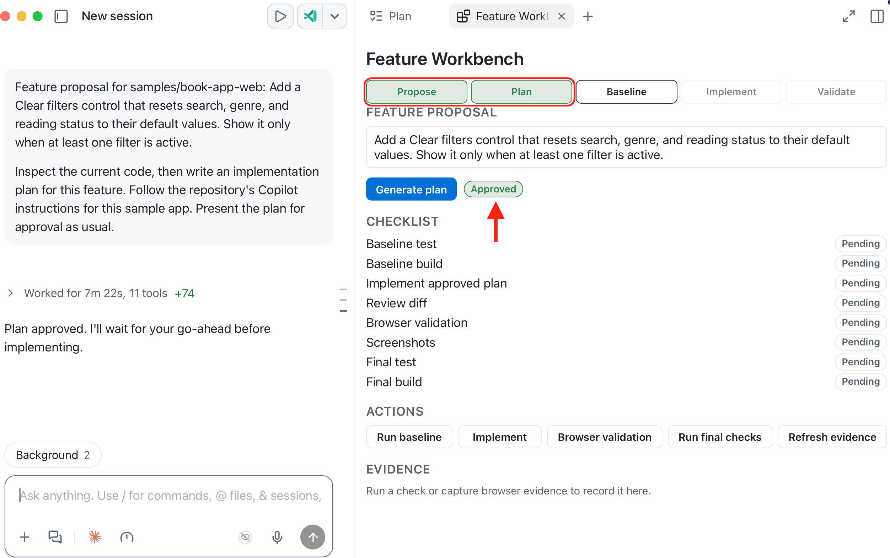
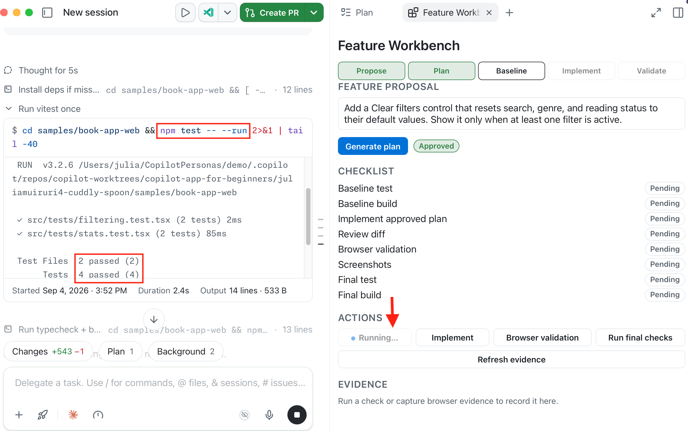
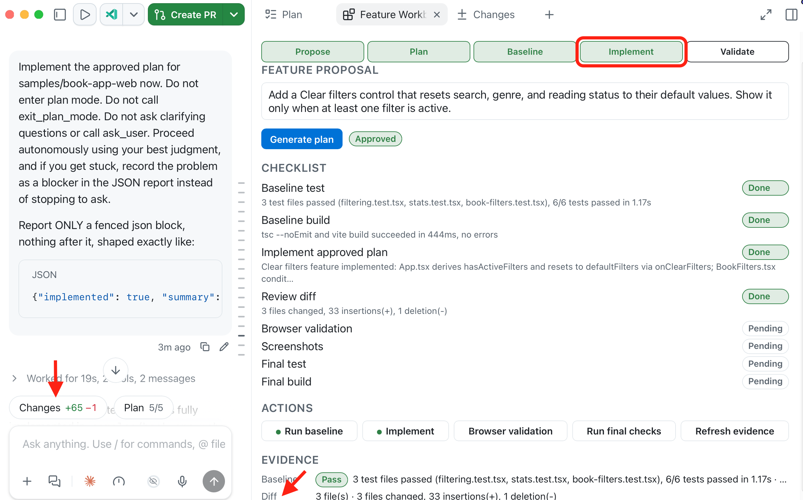
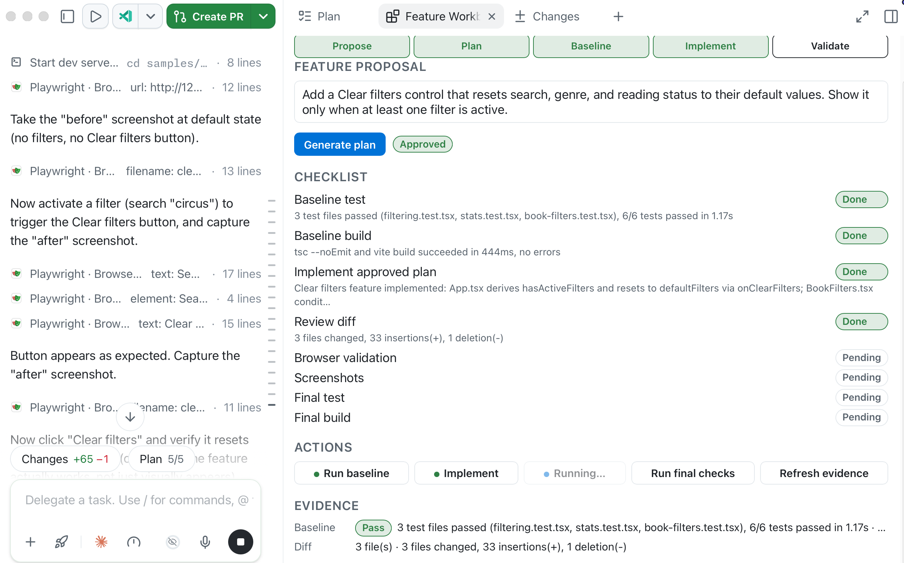
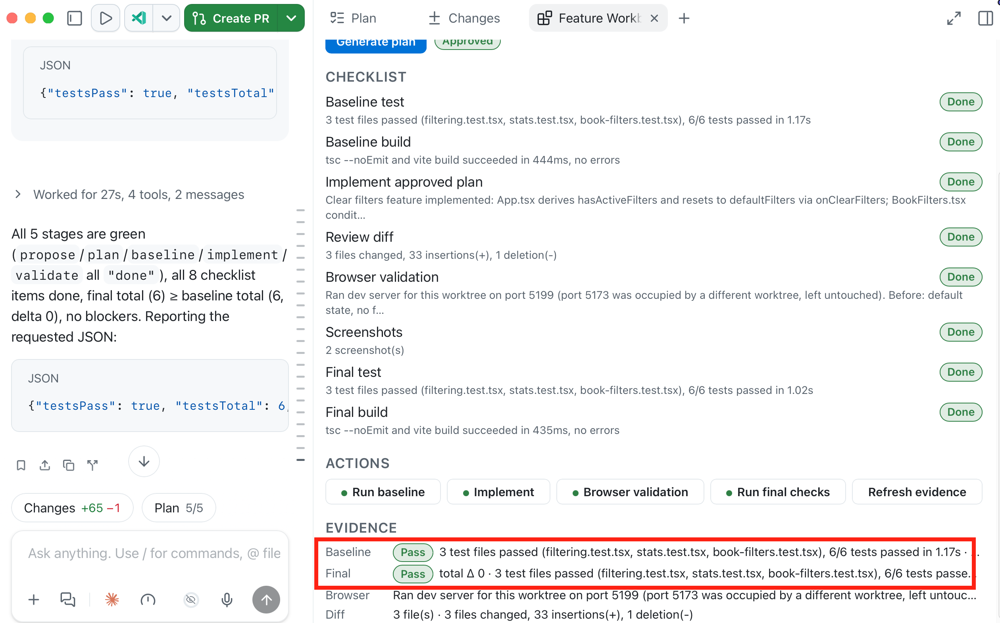

> **What if you and the agent shared a real-time progress board instead of a buried chat thread?**

Chat works well for instruction and ambiguity. Once a GitHub Copilot session is doing real work, a long chat thread becomes hard to scan. You need a visible workspace for human-agent collaboration.

That place is a **canvas**.

A canvas is a shared board in the side panel. You create it with `/create-canvas` and describe the board you want, the app builds it from your prompt and keeps it in sync with both you and the agent.

This chapter asks `/create-canvas` for a **session board**: plan steps, validation checks, and notes.

If `/create-canvas` is missing or the canvas does not open, keep the same board as markdown in the session and continue.

## Learning Objectives

By the end of this chapter, you'll be able to:

- Explain why canvases exist and when a long chat thread gets in the way
- Create a session canvas with `/create-canvas`
- Keep plan state and validation evidence visible on that canvas
- Explain the difference between chat history and shared canvas state

> ⏱️ **Estimated Time**: ~40 minutes

---

## Prerequisites

1. Complete Chapters [00](../00-setup/README.md) and [01](../01-tour-the-app/README.md) for the necessary setup and understanding of the app.
1. Confirm the sample app is ready.

    - Open or create a session for the course repository in a new worktree. 
    - Run the following commands to confirm the sample app is ready:

        ```bash
        cd samples/book-app-web
        npm install
        npm test -- --run
        npm run build
        ```

All tests and the build should pass before you start the exercise.

---

## From the Studio: The Band's Arrangement Board

Imagine a band planning a song. They could argue their options in a long group chat, where decisions get buried, or they could use a shared arrangement board to keep everything visible and organized.


| Group chat | Arrangement board |
|---|---|
| Good for discussion | Good for shared state |
| Hard to scan later | Easy to inspect at a glance |
| Mostly linear | Can show sections, parts, previews, and controls |
| Updates are buried | Updates are visible |

A canvas is the app's arrangement board for human-agent work.

| Term | Meaning in this course |
|---|---|
| Built-in work surfaces | Plan output, terminal, browser, and the Review panel you've already seen in a session |
| Session canvas | The board `/create-canvas` opens in the side panel for this session |
| Chat fallback | The same board returned as markdown in the session if a canvas does not open |

---

## Core Concepts

### A canvas is a shared control panel

Canvases are documented as **bidirectional** work surfaces: both sides (user and agent) can change the same board.

Simple example:

1. GitHub Copilot adds plan steps to the board.
2. You uncheck a step or write "pause before edits" in the notes.
3. GitHub Copilot continues from *your* update, not from a buried chat sentence.

A custom canvas can include:

- visible state
- UI controls
- agent-callable actions, such as updating a checklist item
- artifacts such as plans, checklists, dashboards, browser previews, terminals, or documents


### Built-in work surfaces come first

You already used these panels in earlier chapters. They come with the session. You don't create them.

| Built-in work surface | What you inspect |
|---|---|
| Plan | Execution plan and a checklist of steps before implementation |
| Terminal | Install, test, and build evidence |
| Browser | Running app behavior |
| Changes / Review panel | What changed and what still needs review |

Those panels stay tied to the live session. In this chapter, you'll add one more surface: the session board.

### When to use a canvas

| Use chat when... | Use a canvas when... |
|---|---|
| You need a quick answer | You need visible state |
| The task is short | The task has multiple recurring steps |
| The result can be text | The result needs controls or inspection |
| You don't need to revisit it | You want a reusable work surface for the session |


## Exercise: Create a feature workbench

You will build a reusable canvas that manages the local development inner loop for a new book-app feature. It keeps the feature proposal, plan, implementation and evidence linked to the same session.


> [!NOTE]
> This board is useful only when it stays linked to evidence from the same session. Checking a validation box because the chat sounded confident is not enough.

1. In the current session, type `/` in the prompt box and select `/create-canvas`, **then** paste the prompt below:

    <details>
    <summary>Feature Workbench canvas prompt</summary>

    ```text
    Create a reusable, user-scoped Feature Workbench canvas for the local dev inner loop in @samples/book-app-web. Simple, compact, beginner-readable. No GitHub writes, no source edits while building it.

    Every button = agent-callable action (loading/success/error state, saves agent response). No local-only UI.

    Top: horizontal progress rail = Propose -> Plan -> Baseline -> Implement -> Validate. No Approve stage — approval happens in the chat's Plan tab. Green = evidence-backed done, neutral = current, red = failed/blocked.

    Feature proposal: text input + one Generate plan button. Switches session to plan mode, fires prompt without waiting ("Working..." status), agent inspects code + writes plan as usual, presents for approval in Plan tab (never call exit_plan_mode/ask_user elsewhere). Don't render plan text on canvas — just a small status pill (Working/Review/Approved/Changes requested) polled from exit_plan_mode events. No edit/approve controls on the canvas itself.

    Checklist: baseline test, baseline build, implement approved plan, review diff, browser validation (when required), screenshots (when required), final test, final build.

    Actions in order: Run baseline (test+build, record totals) -> Implement (approved plan only) -> Browser validation (start/reuse dev server, exercise feature, before/after screenshots) -> Run final checks (test+build) -> Refresh evidence. These 4 must never use plan mode/exit_plan_mode/ask_user (unattended), give each a multi-minute timeout not the ~60s default.

    Evidence: read-only, agent-posted only, no learner notes. Dense one-liners: baseline pass/fail pill, final pass/fail pill + total delta, browser summary + screenshot count, diff summary (files changed), blockers. Truncate long text. Green only if tests pass and final total >= baseline. Before any evidence: "Run a check or capture browser evidence to record it here."

    Only mark checklist/rail items from recorded evidence, never chat inference. Dense layout, no big empty textareas, no duplicate buttons, user scope.
    ```
    </details>

    

1. The canvas should open in the right side panel once the agent is done building it.

    >[!IMPORTANT]
    > LLMs are non-deterministic, and so the prompt will produce different outputs on different runs. If you don't get the expected result, try running the prompt again and/or follow the prompt with additional clarifying instructions.

    

1. In **Feature proposal**, paste the following, then select **Generate plan**:

    ```text
    Add a Clear filters control that resets search, genre, and reading status to their default values. Show it only when at least one filter is active.
    ```

    This will:
    - Switch the session mode to **Plan**,
    - Drop a kick-off prompt asking the agent to create an implementation plan for the proposed feature
    - Update the stage on the canvas to reflect current **Propose** stage and the status to **Working ...**

        

1. Review the visible plan in the **Plan tab**, switch back to the canvas tab and then select option **2. Exit plan mode and I will prompt myself** in the chat. The canvas will update to **Plan** stage and status of the proposed feature show **Approved**

    

1. Select **Run baseline** on the canvas. This ensures that the initial state of the application is recorded before making any changes.

    Confirm that the canvas records the individual Vitest test total and build result from terminal output. Expand the working section in the chat to confirm that the right test commands were executed and that the evidence matches the reported results.

    

    Once done, the **Baseline** stage should show as completed on the canvas, baseline test and build items should be crossed off/ marked as done on the checklist and evidence captures the number of tests executed.

1. Select **Implement** to build the feature according to the generated plan.

    See the **Changes** tab to review the modifications and confirm it is limited to the approved feature. The canvas will update to reflect the current **Implement** stage, check off items related to implementation on the checklist and include Diff changes as part of the evidence.

    

1. Select **Browser validation** to have the agent perform a visual check in the browser. You can manually test the feature by interacting with the application and observing the visual changes. In the browser, apply a filter and confirm **Clear filters** appears.

    

1. Select **Run final checks** to ensure that all tests pass - no breaking changes have been introduced.

    

You've seen how the workbench reflects what actually happened in the session, not because a chat response sounds confident. Copilot can update the canvas after an action gathers evidence, but you decide whether that evidence is sufficient.

<details>
<summary>Advanced: Where canvas files live</summary>

You already ran `/create-canvas` on the beginner path. Opening the generated files is optional.

| Location | Scope | Best for |
|---|---|---|
| `~/.copilot/extensions` | User | Personal experiments. Prefer this in the course so nothing is committed |
| `.github/extensions` | Project or team | Shared course and team workflows |

A canvas commonly includes `package.json`, an entry file such as `extension.mjs`, and optional JSON artifacts for persisted state.

Pause before accepting extra generated code. Inspect capability names, stored state, UI controls, and whether any private data is included.

If a canvas fails to open after edits, check extension dependencies, reload requirements, syntax errors, and whether the app is reading the user-scoped or project-scoped folder.

</details>

---

## Troubleshooting

If you are still stuck, see the [Troubleshooting Reference](../appendices/troubleshooting-reference.md).

<details>
<summary>Canvas issues</summary>

| Problem | What to check |
|---|---|
| No canvas opens | Confirm you typed `/create-canvas`. If the command or panel is missing, keep the same board as markdown in the session |
| Built-in terminal or browser missing | Review panel toggle, View menu, app version |
| Agent says it updated the board but state looks wrong | Ask for the full board again and compare it with terminal or browser evidence |
| Validation marked complete without proof | Require evidence; uncheck items that lack output |
| Browser or terminal validation is stale | Confirm the command ran in the correct `samples/book-app-web` worktree |
| Sensitive data appears in a custom canvas | Remove it, regenerate safe sample data, retake screenshots |

</details>

---

## Key Takeaways

1. A canvas gives the session a visible, shared board in the side panel.
2. Create that board with `/create-canvas` and a short description.

---

## Assignment


Extend the Feature Workbench canvas into a full production flow: assess, plan, implement, validate, then carry the change through an issue and a pull request with Copilot review.

Pick one small, beginner-safe improvement in `samples/book-app-web` that you have not already shipped in an earlier chapter.

1. Add an **Assess** stage after **Propose** to evaluate the feature proposal against the app's current behavior
1. Add steps to create a pull request linking to the created issue and request Copilot review.
1. Run the workbench end to end: assess the proposal, plan, implement, validate, then create an issue, open a pull request, and request Copilot review.

Success criteria: The canvas shows evidence-backed progress from assessment through an open pull request with Copilot review requested, and you can tell the next decision from the board without rereading the whole chat.

---

## What's Next

In the next chapter, you'll turn repeatable prompts into automations. You'll start with a manual open-work summary before trying schedules or cloud workflows.

**[← Back to Chapter 04](../04-skills-mcp-plugins/README.md)** | **[Next: Automations →](../06-automations/README.md)**

---

## Source References

- [Working with canvas extensions][canvas-extensions]
- [Customizing the GitHub Copilot app][customize-app]
- [GitHub Copilot app generally available][app-changelog]
- [GitHub Copilot app product blog][app-blog]

[canvas-extensions]: https://docs.github.com/en/copilot/how-tos/github-copilot-app/working-with-canvas-extensions
[customize-app]: https://docs.github.com/en/copilot/how-tos/github-copilot-app/customize-github-copilot-app
[app-changelog]: https://github.blog/changelog/2026-06-17-github-copilot-app-generally-available/
[app-blog]: https://github.blog/news-insights/product-news/github-copilot-app-the-agent-native-desktop-experience/
